```{r setup, include=FALSE}
knitr::opts_chunk$set(
  echo = TRUE,
  eval = FALSE,
  message = TRUE,
  warning = TRUE,
  error = FALSE,
  strip_comments = TRUE
)

strip_inline_comment <- function(line) {
  chars <- strsplit(line, "", fixed = TRUE)[[1]]
  in_single <- FALSE
  in_double <- FALSE
  escaped <- FALSE

  for (i in seq_along(chars)) {
    ch <- chars[[i]]
    if (escaped) {
      escaped <- FALSE
    } else if (ch == "\\") {
      escaped <- TRUE
    } else if (ch == "'" && !in_double) {
      in_single <- !in_single
    } else if (ch == '"' && !in_single) {
      in_double <- !in_double
    } else if (ch == "#" && !in_single && !in_double) {
      return(trimws(substr(line, 1, i - 1), which = "right"))
    }
  }
  line
}

source_hook <- knitr::knit_hooks$get("source")
knitr::knit_hooks$set(source = function(x, options) {
  if (isTRUE(options$strip_comments)) {
    lines <- strsplit(paste(x, collapse = "\n"), "\n", fixed = TRUE)[[1]]
    lines <- vapply(lines, strip_inline_comment, character(1), USE.NAMES = FALSE)
    lines <- lines[!grepl("^\\s*$", lines)]
    x <- paste(lines, collapse = "\n")
  }
  source_hook(x, options)
})
```

This methods-paper R Markdown documents the full WT vs pifq workflow: two
samples, `WT` and `pifq`, processed and integrated together, then carried
through three chapters — single-cell preprocessing, clustering and annotation
(Part 2); pseudobulk differential expression, GO and the co-expression network
(Part 3); and pseudotime trajectory analysis (Part 4). It is intentionally safe
to knit: code blocks are displayed but not executed. To run the analysis,
execute the corresponding sections from `workflow/step1_singlecell.R`,
`workflow/step2_degs.R` and `workflow/step3_pseudotime.py` inside the container.

The active annotation path is bibliography-based (`biblio_marks.txt` ->
`celltype_curated`). Reference-transfer annotation is not part of this draft.

## Minimum computing requirements {-}

The table below summarizes the computing requirements for running the full
pipeline on a personal computer, from raw FASTQ through the downstream Seurat/R
and Python workflow. These are not hard limits; below them the
pipeline still runs, just slower, and heavier steps (Cell Ranger, merging,
PCA/UMAP) risk stalling or exhausting memory.

| Component | Minimum | Recommended |
|---|---:|---:|
| CPU cores | 4 | 16 or more |
| RAM | 32 GB | 64-128 GB for merged multi-sample objects |
| Disk space | 80 GB free | 100 GB free |
| Container runtime | Any OCI-compatible runtime (e.g. Docker) | Docker or Singularity/Apptainer |

This workflow is packaged as a single public image (`matigara/scrnaseq:latest`,
on Docker Hub); the `docker-compose` YAML used to build and run it is kept in
the repository. Any container runtime able to run that image works; the setup
below covers both Docker and Singularity/Apptainer (the latter common on HPC
clusters, where Docker is usually not permitted).

Small pilot datasets can be run on a laptop or desktop if memory is sufficient.
For full experiments, repeated clustering sweeps, Cell Ranger processing from
FASTQ, or large merged Seurat objects, a server or external cluster is strongly
recommended. Cell Ranger is CPU- and memory-intensive and is not installed
inside the downstream `matigara/scrnaseq:latest` Docker image.

\newpage

# Part 1 - Environment and raw data

## Clone the repository

Choose or create a working directory, then clone the pipeline repository
into it:

```bash
mkdir -p ~/my-analysis
cd ~/my-analysis
git clone https://github.com/cliford2001/SingleCell.git
cd SingleCell
```

All paths referenced later in this document (`workflow/`) are relative to
this cloned repository. Its layout is:

```text
SingleCell/
|-- Dockerfile
|-- docker-compose.yml
|-- README.md
|-- data/
|   |-- AtTFDB_loci.txt
|   |-- biblio_marks.txt
|   |-- Arabidopsis_thaliana_TAIR10.1_Araport11_genome.fasta.gz
|   `-- Arabidopsis_thaliana_TAIR10.1_Araport11_annotation.gtf.gz
`-- workflow/
    |-- load_libraries.R                 # R packages
    |-- load_libraries_python.py         # Python packages
    |-- ScRNA_Analysis_Functions.R       # helper functions (Steps 1-2)
    |-- ScRNA_Pseudotime_Functions.py    # helper functions (Step 3)
    |-- step0_cellranger.sh              # Part 1 - Cell Ranger (bash)
    |-- step1_singlecell.R               # Part 2 - single-cell analysis
    |-- step2_degs.R                     # Part 3 - pseudobulk DE + GO
    `-- step3_pseudotime.py              # Part 4 - pseudotime (Python)
```

The bibliography marker table (`data/biblio_marks.txt`) is part of the
repository for this WT vs pifq run (see Section 1).

## Container startup (Docker or Singularity)

The container mounts the cloned repository itself as `/workspace`, so results
are written back into the repository (`resultados/`). Since results are not
pushed upstream, this is not a problem. The same public image runs under either
runtime; always pull it rather than rebuilding from the `Dockerfile`, so every
user gets the exact tested package versions.

**Docker.** Mount the cloned repository and open a shell:

```bash
docker run -it --rm \
  -v $(pwd):/workspace \
  matigara/scrnaseq:latest /bin/bash
```

Or, from inside the cloned repository, `docker compose run r` uses the bundled
`docker-compose.yml` (same image, same `/workspace` mount). On the current
server the Docker container is already running and the project is mounted at
`/workspace`.

**Singularity / Apptainer.** No root is required. Convert the public Docker Hub
image to a local `.sif` once, then open a shell binding the repository to
`/workspace`:

```bash
singularity build scrnaseq.sif docker://matigara/scrnaseq:latest
singularity exec --bind $(pwd):/workspace --pwd /workspace scrnaseq.sif /bin/bash
```

Apptainer imports the image environment, so the bundled Python (`/opt/venv`) and
R stay on `PATH`, and it runs as the invoking user, so files under `resultados/`
are owned by that user rather than by root. The `--pwd /workspace` flag starts
the shell inside the bound repository (otherwise Apptainer warns that the host
working directory does not exist in the container and falls back to `$HOME`).

## Raw data download and Cell Ranger processing

**Run this whole section outside the Docker container**, on a host, server, or
HPC where Cell Ranger is installed. Cell Ranger is *not* bundled inside the
`matigara/scrnaseq:latest` image (that image only covers the downstream R /
Python workflow), so running `cellranger` inside the container returns
`command not found`. Write the Cell Ranger outputs into the cloned repository
directory so they are visible from inside the container (which mounts that same
directory as `/workspace`).

**Install Cell Ranger 9.0.1** (proprietary 10x Genomics software; this workflow
uses version 9.0.1). Get it from the 10x Genomics *previous versions* page:
https://www.10xgenomics.com/support/software/cell-ranger/downloads/previous-versions

1. Log in and accept the license.
2. Find **Cell Ranger 9.0.1** and copy its `curl` command.
3. That URL is signed and time-limited (it carries an `Expires=` timestamp tied
   to your account), so paste the current one — it cannot be hard-coded here or
   reused later. A plain `git clone` of the source repo does *not* give a
   ready-to-run binary.

Then extract it and add it to your `PATH`:

```bash
# Paste the signed curl command for 9.0.1 from the 10x page, e.g.:
curl -o cellranger-9.0.1.tar.gz "https://cf.10xgenomics.com/releases/cell-exp/\
cellranger-9.0.1.tar.gz?Expires=...&Key-Pair-Id=...&Signature=..."

tar -xzvf cellranger-9.0.1.tar.gz
export PATH=$PWD/cellranger-9.0.1/bin:$PATH
cellranger --version
```

The single-cell workflow starts from Cell Ranger output, specifically the
`outs/filtered_feature_bc_matrix/` folder for each sample. If only raw FASTQ
files are available, first download or stage the FASTQs, then run Cell Ranger
for each sample before starting the R workflow.

The WT vs pifq FASTQ files used in this run are public data from
[Han et al., 2023, *Nature Plants*](https://www.nature.com/articles/s41477-023-01544-4#data-availability),
deposited at the CNCB Genome Sequence Archive under BioProject
[PRJCA016521](https://ngdc.cncb.ac.cn/bioproject/browse/PRJCA016521), run
accession `CRA010863`:

| Sample | Run accession | Files |
|---|---|---|
| ScWT | CRR775298 | `CRR775298_f1.fastq.gz`, `CRR775298_r2.fastq.gz` |
| Scpifq | CRR775297 | `CRR775297_f1.fastq.gz`, `CRR775297_r2.fastq.gz` |

Download the reads, then rename/symlink them to the naming Cell Ranger
expects (`<sample>_S1_L001_R1/R2_001.fastq.gz`):

```bash
mkdir -p /workspace/fastq/CRA010863

wget -c -P /workspace/fastq/CRA010863 \
  ftp://download.big.ac.cn/gsa2/CRA010863/CRR775298/CRR775298_f1.fastq.gz
wget -c -P /workspace/fastq/CRA010863 \
  ftp://download.big.ac.cn/gsa2/CRA010863/CRR775298/CRR775298_r2.fastq.gz
wget -c -P /workspace/fastq/CRA010863 \
  ftp://download.big.ac.cn/gsa2/CRA010863/CRR775297/CRR775297_f1.fastq.gz
wget -c -P /workspace/fastq/CRA010863 \
  ftp://download.big.ac.cn/gsa2/CRA010863/CRR775297/CRR775297_r2.fastq.gz

cd /workspace/fastq/CRA010863
ln -s CRR775298_f1.fastq.gz ScWT_S1_L001_R1_001.fastq.gz
ln -s CRR775298_r2.fastq.gz ScWT_S1_L001_R2_001.fastq.gz
ln -s CRR775297_f1.fastq.gz Scpifq_S1_L001_R1_001.fastq.gz
ln -s CRR775297_r2.fastq.gz Scpifq_S1_L001_R2_001.fastq.gz
```

After FASTQs are available, run Cell Ranger for each sample. Cell Ranger itself
is not redistributed in this repository; download it from the official 10x
Genomics GitHub release
(https://github.com/10XGenomics/cellranger/releases/tag/cellranger-9.0.1) and
add it to your `PATH`. Run all commands in this section from the cloned
repository directory, on a host/server/HPC where Cell Ranger is installed (not
inside the container).

The reference genome (TAIR10.1) and Araport11 annotation ship compressed in the
repository under `data/`, so no download is needed. Decompress them and build
the Cell Ranger reference:

```bash
gunzip -k data/Arabidopsis_thaliana_TAIR10.1_Araport11_genome.fasta.gz
gunzip -k data/Arabidopsis_thaliana_TAIR10.1_Araport11_annotation.gtf.gz

cellranger mkref \
  --genome=Ara \
  --fasta=data/Arabidopsis_thaliana_TAIR10.1_Araport11_genome.fasta \
  --genes=data/Arabidopsis_thaliana_TAIR10.1_Araport11_annotation.gtf
```

Run Cell Ranger counts for each sample:

```bash
cellranger count --localcores=80 --id=ScWT --fastqs=/workspace/fastq/CRA010863 \
  --sample=ScWT --transcriptome=Ara --create-bam false

cellranger count --localcores=80 --id=Scpifq --fastqs=/workspace/fastq/CRA010863 \
  --sample=Scpifq --transcriptome=Ara --create-bam false
```

Use the resulting `filtered_feature_bc_matrix/` path in the sample manifest in
Section 1.

\newpage

# Part 2 - Single-cell analysis in R

From this point on, the pipeline runs in R inside the Docker container.
Start R:

```bash
R
```

The next two steps, Configuration and Initialization, set up the paths and
helper functions used by every section that follows.

## Configuration


Edit this block before running the pipeline.


```{r configuration}
# CONFIGURATION - Edit only this block before running the pipeline
# =============================================================================

# Directory containing the pipeline helper scripts.
# The cloned repository itself is mounted as /workspace.
PIPELINE_DIR <- "/workspace/workflow"

# Root directory for your project data and results.
# All result files will be written to DATA_DIR/resultados/<step>/
DATA_DIR   <- "/workspace/."
base_dir   <- file.path(DATA_DIR, "resultados")

# =============================================================================
```


## Initialization


Load helper scripts, set reproducibility options, and create output directories.


```{r initialization}
# INITIALIZATION
# =============================================================================

# -- Load helper scripts --------------------------------------------------------
# Each file is fully documented at https://github.com/cliford2001/SingleCell
source(file.path(PIPELINE_DIR, "load_libraries.R"))          # all R packages
source(file.path(PIPELINE_DIR, "ScRNA_Analysis_Functions.R"))# analysis functions

set.seed(1807)
options(Seurat.allow.s4 = FALSE)  # required for Seurat 5 compatibility
setwd(DATA_DIR)

# -- Create per-step output directories ----------------------------------------
list2env(create_pipeline_dirs(base_dir), envir = .GlobalEnv)  # creates output folders and loads their paths as variables

# output_dir is the global variable used by save_pdf / save_qc / save_vln helpers.
# It is reassigned at the start of each section to the appropriate step directory.
output_dir <- base_dir


# =============================================================================
# ########################  PART 1 - SINGLE-CELL ANALYSIS  ####################
# =============================================================================
```

\newpage

## Section 1 - Data loading and pre-filter QC

```{r section_01_data_loading_and_pre_filter_qc}
# SECTION 1 - DATA LOADING AND PRE-FILTER QC
# =============================================================================
# Each sample is loaded from its input file and mitochondrial / chloroplast
# read fractions are computed per cell to guide filtering thresholds in
# Section 2. Pre-filter violin plots are saved to 01_qc/.
#
# +- CHANGE FOR YOUR ORGANISM --------------------------------------------------
#   Arabidopsis : mt_pattern = "^ATMG"  |  cp_pattern = "^ATCG"
#   Human       : mt_pattern = "^MT-"   |  cp_pattern = NULL
#   Mouse       : mt_pattern = "^mt-"   |  cp_pattern = NULL
# +-----------------------------------------------------------------------------
output_dir <- dir_01

# -- Sample manifest (CellRanger filtered_feature_bc_matrix) ------------------
# Add one entry per sample. Each entry needs:
#   file      - path to the filtered_feature_bc_matrix/ directory (relative to DATA_DIR)
#   label     - unique name for this sample (appears in all plots)
#   condition - experimental group this sample belongs to
samples <- list(
  list(
    file      = "ScWT/outs/filtered_feature_bc_matrix",
    label     = "WT",
    condition = "WT"
  ),
  list(
    file      = "Scpifq/outs/filtered_feature_bc_matrix",
    label     = "pifq",
    condition = "pifq"
  )
)


# -- Plot colors (one color per sample label) -----------------------------------
colors <- c(
  "WT"  = "#66c2a5",
  "pifq"  = "#fc8d62"
)


mt_pattern <- "^ATMG"  # Arabidopsis mitochondrial genes
cp_pattern <- "^ATCG"  # Arabidopsis chloroplast genes


# Load all samples using the helper function
seurat_list_raw <- load_seurat_samples(samples = samples,
                                       DATA_DIR = DATA_DIR,
                                       mt_pattern = mt_pattern,
                                       cp_pattern = cp_pattern)

plot_qc_batch(seurat_list_raw, colors, "qc_prefilter.pdf")


# =============================================================================

message("\nOK SECTION 1 COMPLETE: QC pre-filter plots saved")
```

Representative output from Section 1:

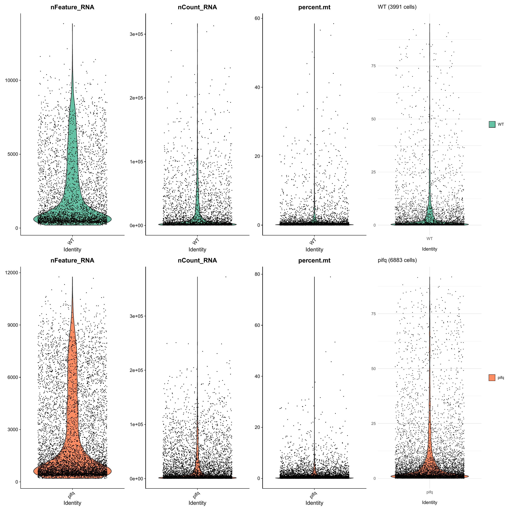{width=30%}

\newpage

## Section 2 - Cell filtering and doublet detection

```{r section_02_cell_filtering_and_doublet_detection}
output_dir <- dir_01

seurat_list <- filter_seurat_samples(seurat_list_raw, min_features = 200, max_mt = 5)

plot_qc_batch(seurat_list, colors, "qc_postfilter.pdf")

saveRDS(seurat_list, file.path(dir_objects, "seurat_list_postfilter.rds"))

message("\nOK SECTION 2 COMPLETE: filtering and doublet detection complete")
```

Representative output from Section 2:

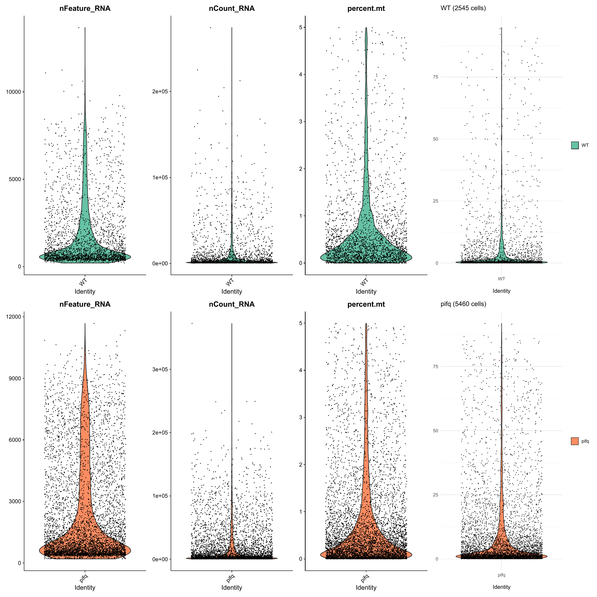{width=30%}

\newpage

## Section 3 - Merge and initial preprocessing

```{r section_03_merge_and_initial_preprocessing}
output_dir <- dir_01

pbmc_harmony <- reduce(seurat_list, merge) %>%
  NormalizeData(verbose = FALSE) %>%
  FindVariableFeatures(
    selection.method = "vst", nfeatures = 2000, verbose = FALSE
  ) %>%
  ScaleData(verbose = FALSE) %>%
  RunPCA(npcs = 30, verbose = FALSE) %>%
  RunUMAP(reduction = "pca", dims = 1:30, verbose = FALSE)

save_pdf(
  DimPlot(pbmc_harmony, group.by = "orig.ident", cols = colors),
  "umap_preharmony.pdf"
)

saveRDS(pbmc_harmony, file.path(dir_objects, "pbmc_harmony_preharmony.rds"))

message("\nOK SECTION 3 COMPLETE: merge and preprocessing complete")
```

Representative output from Section 3:

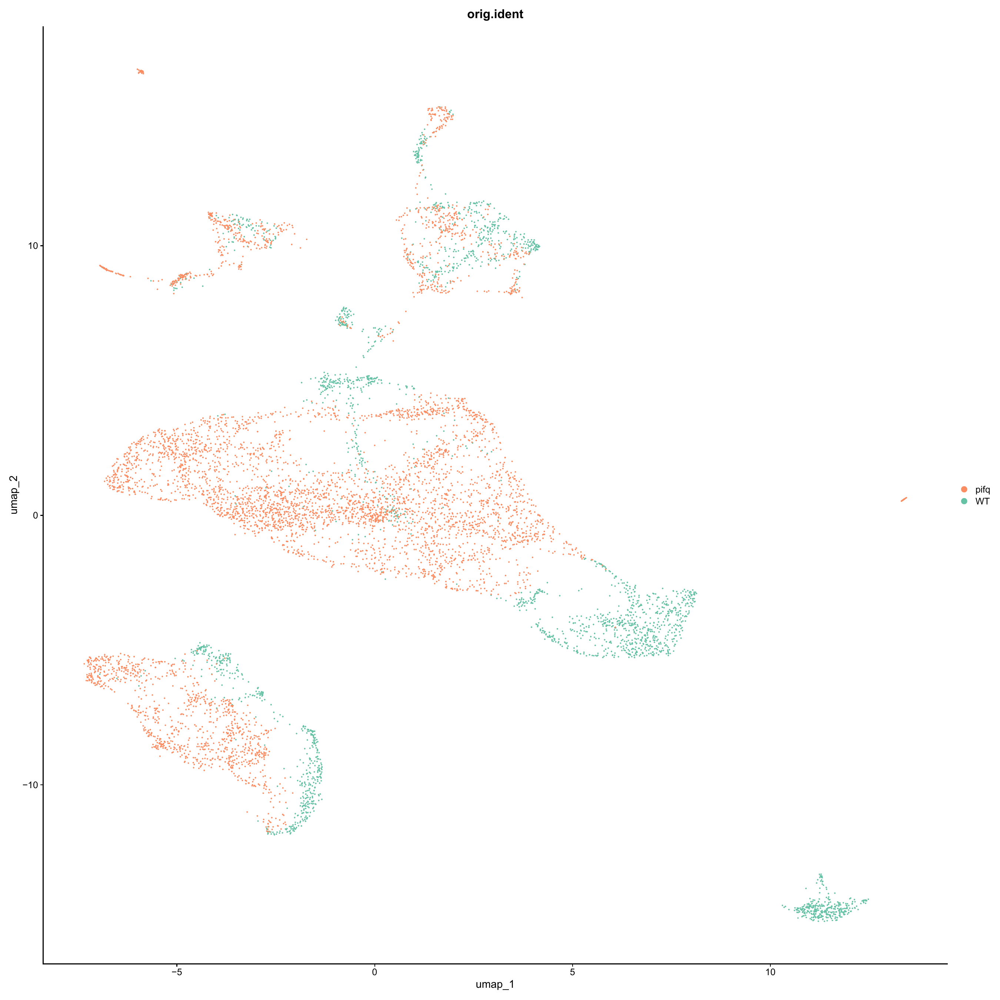{width=30%}

\newpage

## Section 4 - Harmony batch correction

```{r section_04_harmony_batch_correction}
output_dir <- dir_01

pbmc_harmony <- pbmc_harmony %>%
  RunHarmony("orig.ident", plot_convergence = FALSE) %>%
  RunUMAP(reduction = "harmony", dims = 1:30, verbose = FALSE)

save_pdf(
  DimPlot(pbmc_harmony, group.by = "orig.ident", cols = colors),
  "umap_postharmony.pdf"
)

saveRDS(pbmc_harmony, file.path(dir_objects, "pbmc_harmony_postharmony.rds"))

message("\nOK SECTION 4 COMPLETE: Harmony integration complete")
```

Representative output from Section 4:

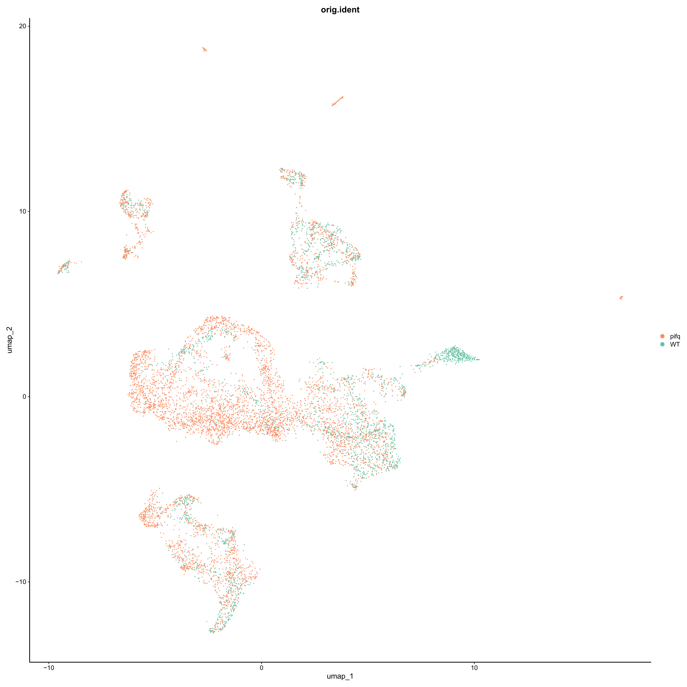{width=30%}

\newpage

## Section 5 - Resolution optimization

```{r section_05_resolution_optimization}
resolutions_test <- c(0.15, 0.35, 0.45, 0.55, 1.0)

output_dir <- dir_02

k_range <- 1:31
pca_data <- Embeddings(pbmc_harmony, "pca")[, 1:30]
wss <- sapply(
  k_range,
  function(k) kmeans(pca_data, centers = k, nstart = 4)$tot.withinss
)

elbow_plot <- ggplot(data.frame(k = k_range, wss = wss), aes(k, wss)) +
  geom_line() +
  geom_point() +
  labs(
    x = "Number of clusters (k)",
    y = "Within-cluster sum of squares"
  ) +
  theme_minimal()

save_pdf(elbow_plot, "elbow_plot.pdf", w = 18, h = 18)

clu <- pbmc_harmony %>%
  RunUMAP(reduction = "harmony", dims = 1:30, verbose = FALSE) %>%
  FindNeighbors(reduction = "harmony", dims = 1:30, k.param = 20, verbose = FALSE)

for (res in resolutions_test)
  clu <- FindClusters(clu, resolution = res, algorithm = 4, verbose = FALSE)

save_pdf(clustree(clu, prefix = "RNA_snn_res."), "clustree2.pdf", w = 18, h = 18)

message("\nOK SECTION 5 COMPLETE: elbow plot and clustree saved")
```

Representative outputs from Section 5:

```{=latex}
\begin{center}
```
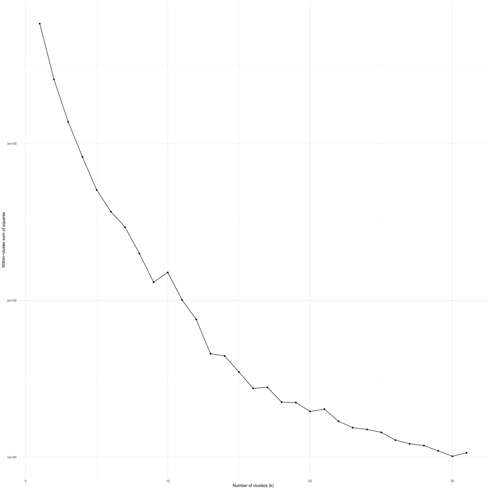{width=30%} 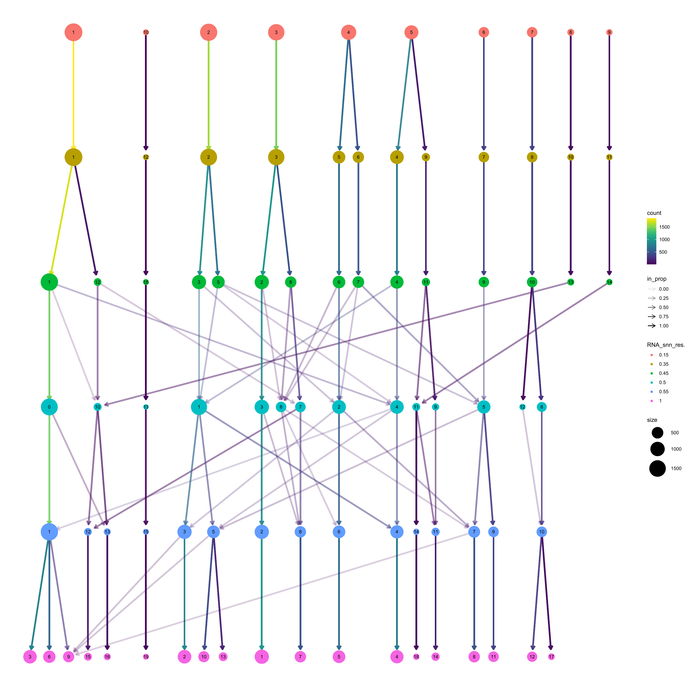{width=30%}
```{=latex}
\end{center}
```

\newpage

## Section 6 - Final clustering

```{r section_06_final_clustering}
cluster_resolution <- 0.35
output_dir <- dir_02

pbmc_harmony <- pbmc_harmony %>%
  RunUMAP(reduction = "harmony", dims = 1:30, verbose = FALSE) %>%
  FindNeighbors(reduction = "harmony", dims = 1:30, k.param = 20, verbose = FALSE) %>%
  FindClusters(resolution = cluster_resolution, algorithm = 4, verbose = FALSE)

Idents(pbmc_harmony) <- "seurat_clusters"
save_pdf(
  DimPlot(pbmc_harmony, group.by = "seurat_clusters", label = TRUE),
  "umap_seuratclusters.pdf"
)

message("\nOK SECTION 6 COMPLETE: final clustering complete")
```

Representative output from Section 6:

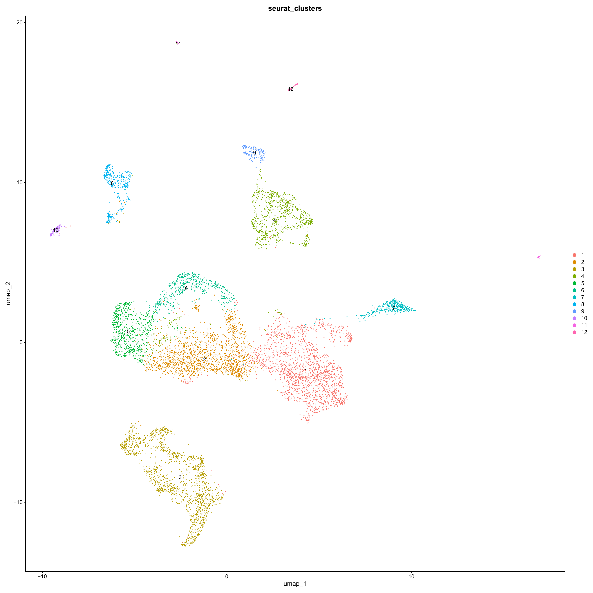{width=30%}

\newpage

## Section 7 - Cell-type annotation

```{r section_07_cell_type_annotation}
output_dir <- dir_03

biblio_marks_file <- file.path(DATA_DIR, "data", "biblio_marks.txt")
marker_table <- read.table(
  biblio_marks_file, header = TRUE, sep = "\t", quote = ""
)

markers <- find_markers(
  pbmc_harmony,
  output_file = file.path(output_dir, "FindAllMarkers.tsv")
)

pbmc_harmony <- annotate_by_markers(
  pbmc_harmony, markers,
  reference_file = biblio_marks_file
)

plot_marker_dotplot(
  pbmc_harmony,
  marker_table,
  annot_col = "celltype",
  outfile   = file.path(
    output_dir, "dotplot_marker_table_annotation_biblio.pdf"
  ),
  width = 18, height = 18
)

save_pdf(
  DimPlot(
    pbmc_harmony, group.by = "celltype",
    label = TRUE, repel = TRUE, raster = FALSE
  ),
  "umap_annotation_biblio.pdf"
)

message("\nOK SECTION 7 COMPLETE: cell-type annotation complete")
```

Representative outputs from Section 7:

```{=latex}
\begin{center}
```
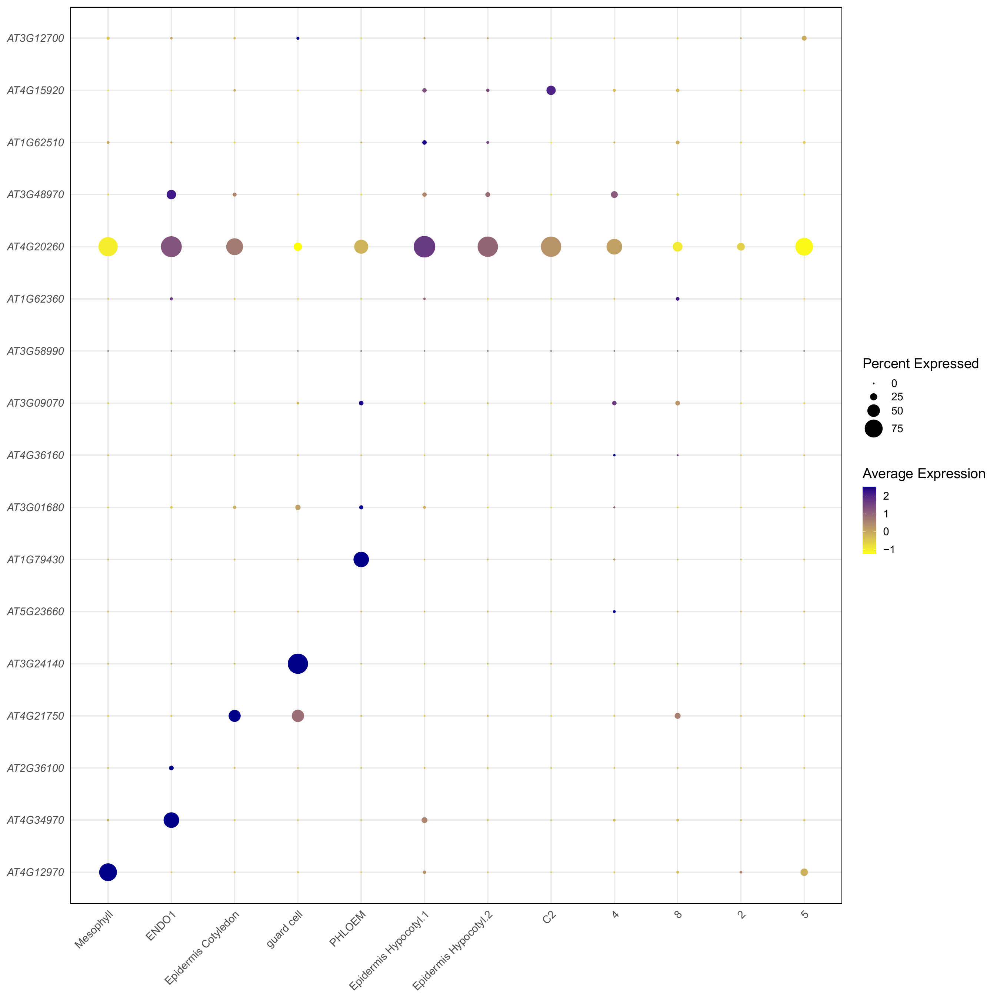{width=30%} 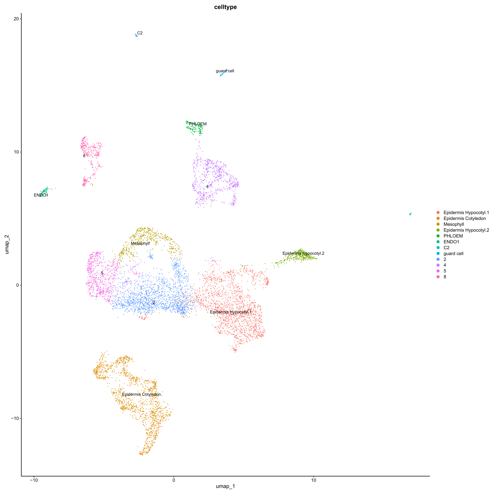{width=30%}
```{=latex}
\end{center}
```

\newpage

## Section 8 - Annotated clustree

```{r section_08_annotated_clustree}
output_dir <- dir_03

Mode <- function(x) {
  x <- as.character(x)
  x <- x[!is.na(x) & nzchar(x)]
  if (length(x) == 0) return(NA_character_)
  names(sort(table(x), decreasing = TRUE))[1]
}

stopifnot(exists("clu"))
stopifnot("celltype" %in% colnames(pbmc_harmony@meta.data))

celltype_label <- as.character(pbmc_harmony$celltype)
names(celltype_label) <- Cells(pbmc_harmony)
clu$celltype_label <- celltype_label[Cells(clu)]

print(table(clu$celltype_label, useNA = "ifany"))

save_pdf(
  clustree(
    clu, prefix = "RNA_snn_res.",
    node_label = "celltype_label", node_label_aggr = "Mode"
  ),
  "clustree_annotated.pdf", w = 14, h = 14
)

message("\nOK SECTION 8 COMPLETE: annotated clustree saved")
```

Representative output from Section 8:

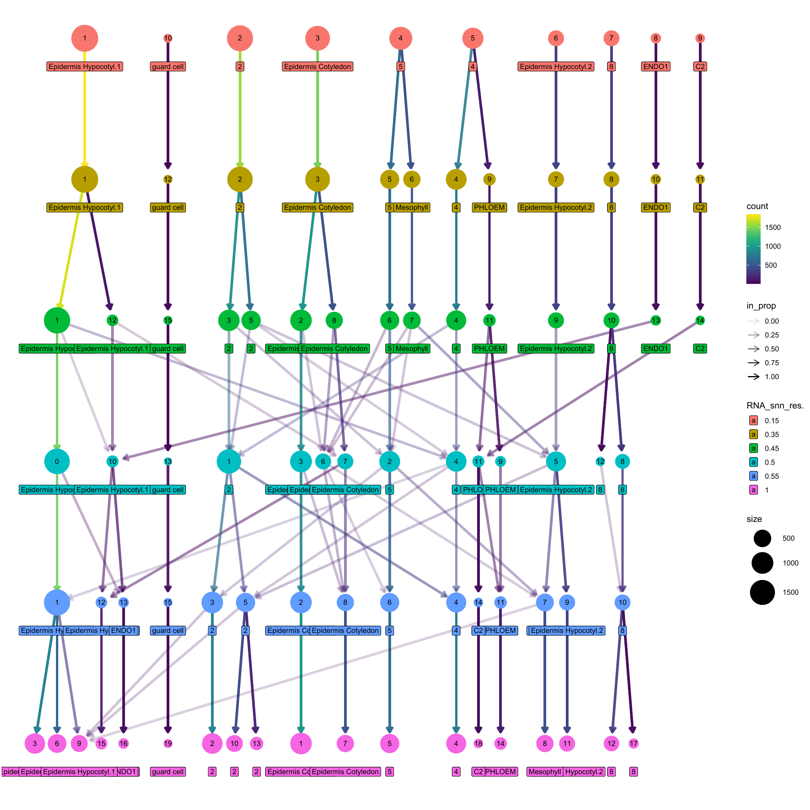{width=30%}

\newpage

## Section 9 - Gene expression visualization

```{r section_09_gene_expression_visualization}
gene <- "AT5G26000"

output_dir <- dir_04

pbmc_harmony <- JoinLayers(pbmc_harmony)
Idents(pbmc_harmony) <- "celltype"

save_vln(
  VlnPlot(pbmc_harmony, features = gene),
  "vln_gene_all.pdf"
)

save_pdf(
  FeaturePlot(pbmc_harmony, features = gene),
  "feature_gene_all.pdf"
)

message("\nOK SECTION 9 COMPLETE: gene expression visualization saved")
```

Representative outputs from Section 9:

```{=latex}
\begin{center}
```
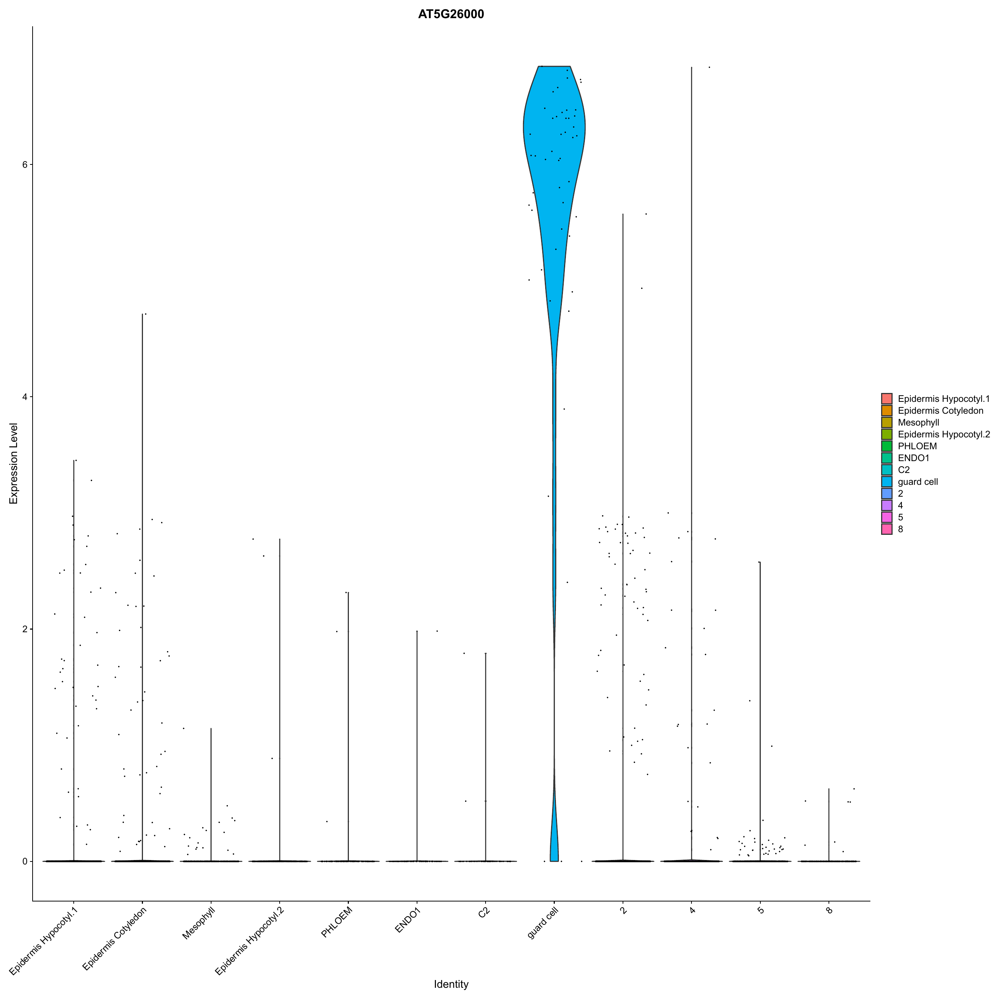{width=30%} 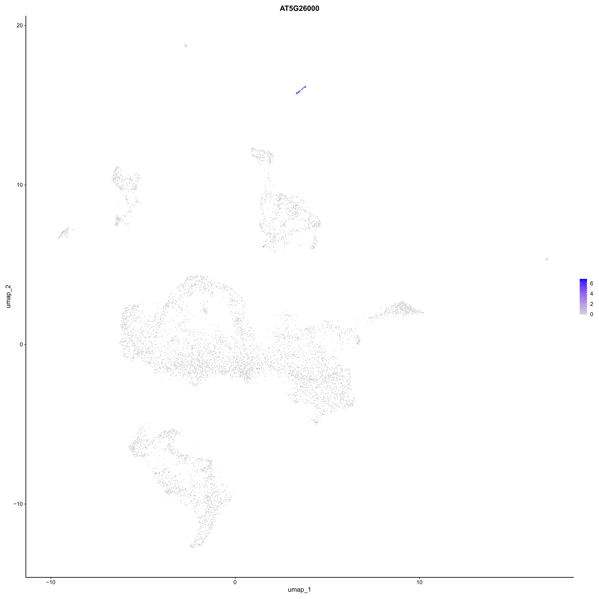{width=30%}
```{=latex}
\end{center}
```

\newpage

## Section 10 - Cell-type grouping [optional]

```{r section_10_cell_type_grouping_optional, strip_comments=FALSE}
grouping <- c()
# Example:
# grouping <- c(
#   "Epidermis Hypocotyl.1" = "Epidermis Hypocotyl",
#   "Epidermis Hypocotyl.2" = "Epidermis Hypocotyl"
# )

output_dir <- dir_05

if (length(grouping) > 0) {
  pbmc_harmony$celltype_grouped <- recode(pbmc_harmony$celltype, !!!grouping)
} else {
  pbmc_harmony$celltype_grouped <- pbmc_harmony$celltype
}

save_pdf(
  DimPlot(
    pbmc_harmony, group.by = "celltype_grouped",
    label = TRUE, repel = TRUE, raster = FALSE
  ),
  "umap_grouped.pdf"
)

message("\nOK SECTION 10 COMPLETE: cell-type grouping complete")
```

Representative output from Section 10:

{width=30%}

\newpage

## Section 11 - Subcluster marker inspection [optional]

This section is intentionally interactive. `inspect_subcluster_markers()`
subclusters one cluster and saves a combined figure (subcluster UMAP, marker
dotplot, and a small FeaturePlot grid) to help decide whether curation is
needed. After reviewing the figures, `curate_clusters()` re-inspects the chosen
clusters and reassigns their subclusters to the labels you provide, writing the
result into `celltype_curated`. Both helpers live in
`ScRNA_Analysis_Functions.R`.

```{r section_11_interactive_cell_type_curation_optional, eval=FALSE, strip_comments=FALSE}
output_dir <- dir_05
Idents(pbmc_harmony) <- "celltype"

# 1. Inspect a cluster (saves the combined subcluster + marker figure)
inspect_subcluster_markers(
  pbmc_harmony, cluster_id = "2",
  marker_table = marker_table, output_dir = output_dir
)

# 2. Map each cluster's subclusters to labels ("others" = any ID not listed),
#    then curate them in one call. Example for two clusters:
reassign <- list(
  "2" = c("0" = "Identity A", "others" = "Unresolved"),
  "4" = c("1" = "Identity B", "others" = "Unresolved")
)
pbmc_harmony <- curate_clusters(
  pbmc_harmony, reassign,
  marker_table = marker_table, output_dir = output_dir
)

# 3. Save the curated annotation UMAP
save_pdf(
  DimPlot(pbmc_harmony, group.by = "celltype_curated",
          label = TRUE, repel = TRUE, raster = FALSE),
  "umap_curated.pdf"
)

message("\nOK SECTION 11 COMPLETE: curation complete")
```

Representative outputs from Section 11:

```{=latex}
\begin{center}
```
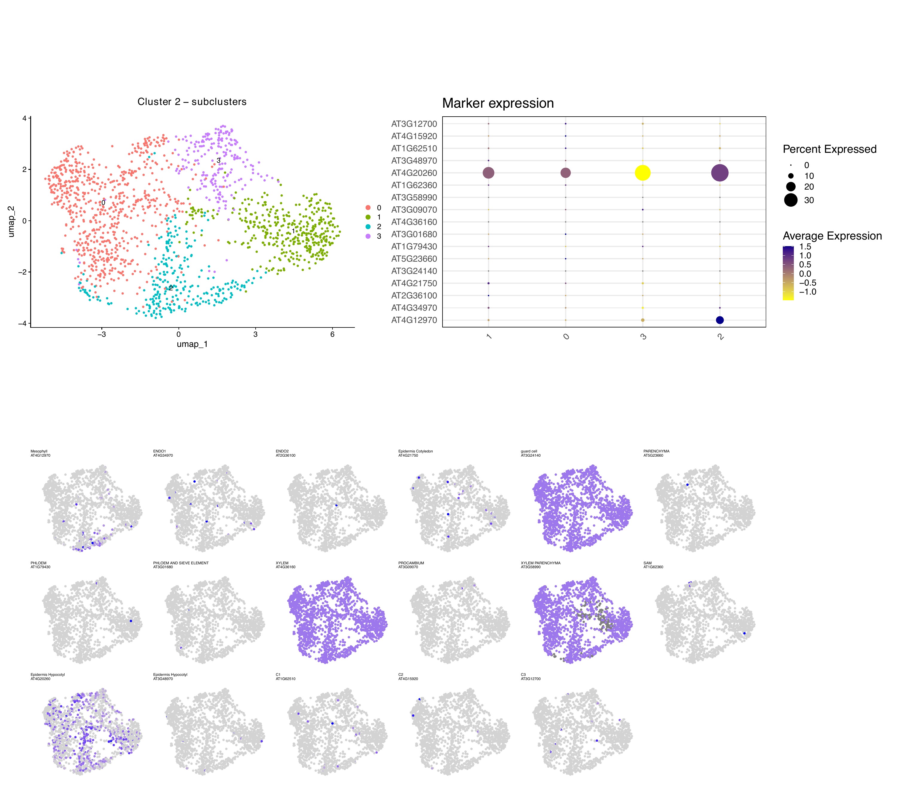{width=30%} 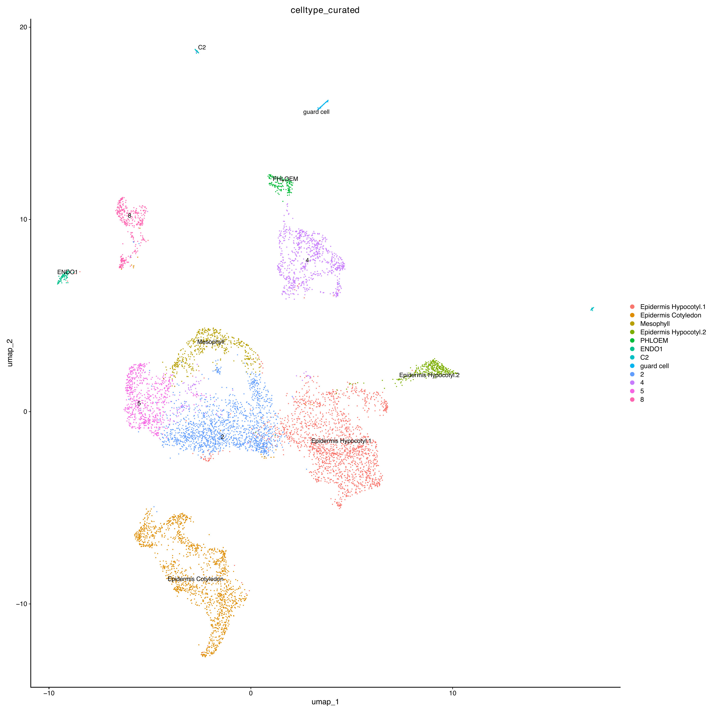{width=30%}
```{=latex}
\end{center}
```

## Section 12 - Export the curated object

Closes Chapter 1 by saving the curated object in two formats: an `.rds`
checkpoint for the R-based Chapter 2, and an AnnData `.h5ad` for the
Python-based Chapter 3 trajectory and velocity analyses (Scanpy, scFates,
Palantir - all pre-installed in the Docker image).

```{r section_12_export, strip_comments=FALSE}
# Checkpoint - restore with:
#   pbmc_harmony <- readRDS(file.path(dir_objects, "pbmc_harmony_curated.rds"))
saveRDS(pbmc_harmony, file.path(dir_objects, "pbmc_harmony_curated.rds"))

# Export the curated object to AnnData h5ad format for Python-based
# trajectory and velocity analyses.
export_to_scanpy(
  pbmc_harmony,
  file.path(dir_objects, "pbmc_harmony_curated.h5ad")
)

# To export a specific cell type only:
# export_to_scanpy(
#   subset(pbmc_harmony, subset = celltype_curated == "guard cell"),
#   file.path(dir_objects, "GuardCell.h5ad")
# )

message("\nOK SECTION 12 COMPLETE: curated object saved (.rds + .h5ad)")
```

\newpage

# Part 3 - Pseudobulk differential expression and GO

This part continues from the object saved at the end of Chapter 1. It
aggregates cells into pseudo-replicates per cell type, runs pseudobulk DESeq2
for the WT vs pifq contrast, and summarizes results with volcano plots,
differential tables, GO enrichment, a log2FC heatmap, and co-expression
networks.

```{r part3_load_curated}
pbmc_harmony <- readRDS(file.path(dir_objects, "pbmc_harmony_curated.rds"))
```

## Section 13 - Cell-type subsets

The annotation column used to define cell types is a user choice. Depending on
how Chapter 1 was run, this is one of `celltype` (bibliography annotation),
`celltype_grouped` (broad groups from Section 10), or `celltype_curated`
(manual curation from Section 11). All downstream sections in this part use
whichever column is set here.

```{r section_13_cell_type_subsets}
pseudobulk_annot_col <- "celltype_curated"

# Inspect how many cells each cell type has before subsetting
table(pbmc_harmony[[pseudobulk_annot_col]])

cell_type_subsets <- create_cell_type_subsets(
  pbmc_harmony, annot_col = pseudobulk_annot_col
)

message("\nOK SECTION 13 COMPLETE: cell-type subsets created")
```

Cells per cell type (first three shown):

| Cell type | Cells |
|---|---:|
| Epidermis_Hypocotyl_1 | 1847 |
| Epidermis_Cotyledon | 1461 |
| Mesophyll | 488 |

## Section 14 - Pseudo-replicate assignment

```{r section_14_pseudoreplicate_assignment}
pseudobulk_conditions <- NULL
n_pseudoreps          <- 3

cell_type_subsets_replicates <- assign_pseudoreplicates_batch(
  cell_type_subsets,
  pseudobulk_conditions = pseudobulk_conditions,
  n_pseudoreps          = n_pseudoreps
)

# Inspect cells per pseudo-replicate for one cell type
table(cell_type_subsets_replicates[["Mesophyll"]]$replicate)

message("\nOK SECTION 14 COMPLETE: pseudo-replicates assigned")
```

Cell types present in only one condition (e.g. `C2`, present in only 57 cells
from a single sample) are dropped here, since a WT vs pifq contrast needs both
conditions represented.

Cells per pseudo-replicate (first three cell types shown):

| Cell type | Replicate | Cells |
|---|---|---:|
| Epidermis_Hypocotyl_1 | pifq_rep1 | 329 |
| Epidermis_Hypocotyl_1 | pifq_rep2 | 366 |
| Epidermis_Hypocotyl_1 | pifq_rep3 | 346 |
| Epidermis_Hypocotyl_1 | WT_rep1 | 279 |
| Epidermis_Hypocotyl_1 | WT_rep2 | 272 |
| Epidermis_Hypocotyl_1 | WT_rep3 | 255 |
| Epidermis_Cotyledon | pifq_rep1 | 316 |
| ... | ... | ... |

## Section 15 - Pseudobulk tables and DESeq2

```{r section_15_pseudobulk_deseq2}
comparisons <- list(
  list(conds = c("WT", "pifq"), tag = "WT_vs_pifq")
)
cell_types_to_analyze <- NULL
output_dir <- dir_06

deseq2_results <- run_pseudobulk_deseq2_analysis(
  cell_type_subsets_replicates = cell_type_subsets_replicates,
  comparisons    = comparisons,
  output_dir     = output_dir,
  cell_types     = cell_types_to_analyze,
  pseudobulk_dir = file.path(dir_objects, "pseudobulk_replicas")
)

message("\nOK SECTION 15 COMPLETE: pseudobulk aggregation and DESeq2 complete")
```

One `DESeq2_<cell_type>_WT_vs_pifq.csv` is written per cell type: the standard
DESeq2 results table (one row per gene, with `log2FoldChange`, `pvalue`, and
`padj`). Positive log2FC means higher expression in pifq. First rows of the
Mesophyll table:

```text
             baseMean  log2FoldChange   lfcSE      stat     pvalue      padj
AT1G01010    46.22     -2.102           0.307     -6.857   7.0e-12     9.7e-11
AT1G01020    48.78      0.100           0.326      0.306   7.6e-01     8.5e-01
AT1G01030   172.27      0.437           0.306      1.428   1.5e-01     2.8e-01
```

## Section 16 - Volcano plots

```{r section_16_volcano_plots}
volcano_tag <- "WT_vs_pifq"
padj_cut    <- 0.05
lfc_cut     <- 1

render_volcano_plots(
  results_dir = file.path(dir_06, volcano_tag),
  output_dir  = file.path(dir_06, volcano_tag, "volcano"),
  pdf_name    = paste0("VolcanoPlots_", volcano_tag, ".pdf"),
  padj_cut    = padj_cut,
  lfc_cut     = lfc_cut
)

message("\nOK SECTION 16 COMPLETE: volcano plots saved")
```

Representative output from Section 16:

{width=30%}

## Section 17 - Differential gene tables

```{r section_17_differential_gene_tables}
diff_prefix <- paste0("diff_table_", volcano_tag)

diff_tables <- build_differential_tables(
  results_dir = file.path(dir_06, volcano_tag),
  output_dir  = file.path(dir_06, volcano_tag),
  padj_cut    = padj_cut,
  lfc_cut     = lfc_cut,
  prefix      = diff_prefix
)

message("\nOK SECTION 17 COMPLETE: differential gene tables saved")
```

This writes two combined matrices (genes x cell types). The class matrix
(`diff_table_WT_vs_pifq_*.tsv`) uses `+1`/`-1`/`0` to flag genes up-, down-, or
not significantly regulated in each cell type; the log2FC matrix
(`tabla_log2FC_*.tsv`) holds the actual fold changes (`NA` where not
significant). Example rows for three annotated cell types (Epidermis
Cotyledon, guard cell, Mesophyll):

```text
# class matrix                       # log2FC matrix
gene_id    EpiCot  guard  Meso       gene_id    EpiCot  guard  Meso
AT1G29930    1       1      1        AT1G29930    4.79    3.51   2.02
AT1G54410   -1       1     -1        AT1G54410   -1.23    2.52  -1.88
AT1G55670    1       1      1        AT1G55670    3.58    4.05   1.66
```

## Section 18 - GO enrichment

```{r section_18_go_enrichment}
go_space    <- "BP"
go_orgdb    <- org.At.tair.db
go_keytype  <- "TAIR"
padj_cutoff <- 0.05

go_results <- run_go_enrichment_for_contrast(
  results_dir  = file.path(dir_06, volcano_tag),
  output_dir   = file.path(dir_07, volcano_tag),
  orgdb        = go_orgdb,
  keytype      = go_keytype,
  go_space     = go_space,
  padj_cutoff  = padj_cutoff,
  contrast_tag = volcano_tag
)

message("\nOK SECTION 18 COMPLETE: GO enrichment complete")
```

Representative output from Section 18:

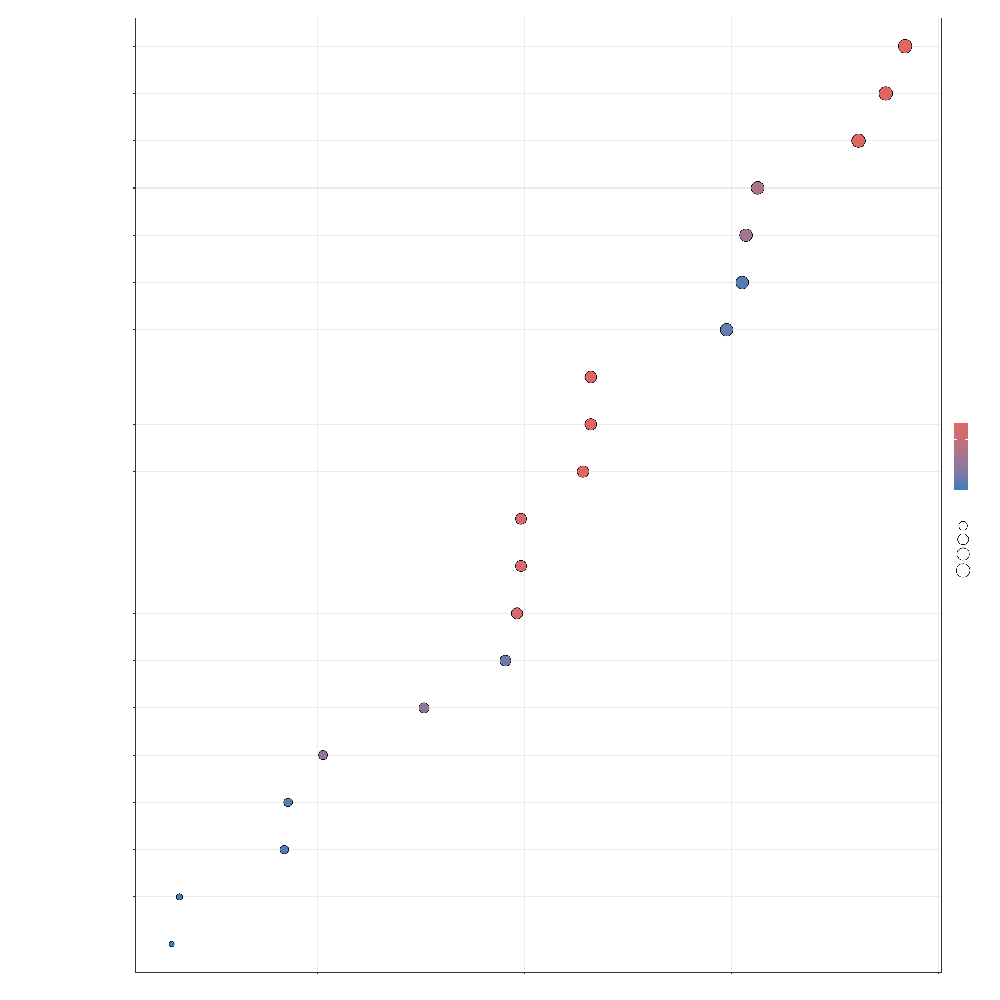{width=30%}

## Section 19 - Log2FC heatmap

Rows (genes) are ordered by hierarchical clustering, so genes with similar
cross-cell-type profiles group together. Columns (cell types) follow the
marker-table order via `cell_order`; cell types not present in the marker
table (the unannotated clusters) are placed at the end.

```{r section_19_log2fc_heatmap}
heatmap_limits <- c(-5, 5)

build_logfc_heatmap(
  logfc_table  = diff_tables$logfc,
  contrast_tag = volcano_tag,
  output_dir   = file.path(dir_06, volcano_tag),
  limits       = heatmap_limits,
  cell_order   = unique(marker_table$cell.types)
)

message("\nOK SECTION 19 COMPLETE: log2FC heatmap saved")
```

Representative output from Section 19:

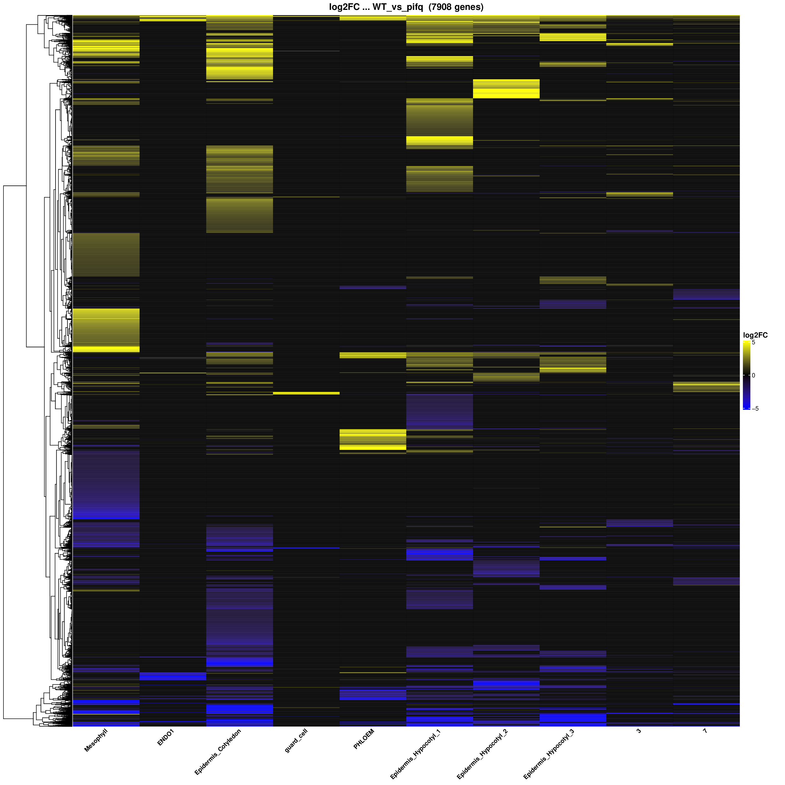{width=30%}

\newpage

## Section 20 - Gene-gene coexpression and TF network

`run_tf_coexpression_network()` does the whole network step in one call: it
builds the hdWGCNA gene-gene co-expression network from the significant DE
genes, exports the edge list (`edges_unified.tsv`, `source | target | weight`),
then filters to TF-containing pairs (AtTFDB) and draws the TF network colored
by DE direction. No module-clustering plots are produced. Only the parameters
below are meant to be edited.

```{r section_20_tf_coexpression_network}
run_tf_coexpression_network(
  seurat_obj      = pbmc_harmony,
  de_table_path   = file.path(dir_06, volcano_tag, "tabla_log2FC_fc1_padj_005.tsv"),
  tf_list_path    = file.path(DATA_DIR, "data", "AtTFDB_loci.txt"),
  output_dir      = dir_08,
  annot_col       = pseudobulk_annot_col,
  contrast_tag    = volcano_tag,
  n_metacells     = 50,     # metacells per cell type x sample
  min_module_size = 20,     # minimum genes per co-expression module
  deep_split      = 2,      # module-splitting sensitivity (0-4)
  soft_power      = NULL,   # NULL = auto-detect the soft power
  tom_threshold   = 0.2,    # minimum co-expression weight to keep an edge
  n_hub_label     = 15      # number of top hub TFs to label
)

message("\nOK SECTION 20 COMPLETE: TF coexpression network saved")
```

Representative output from Section 20:

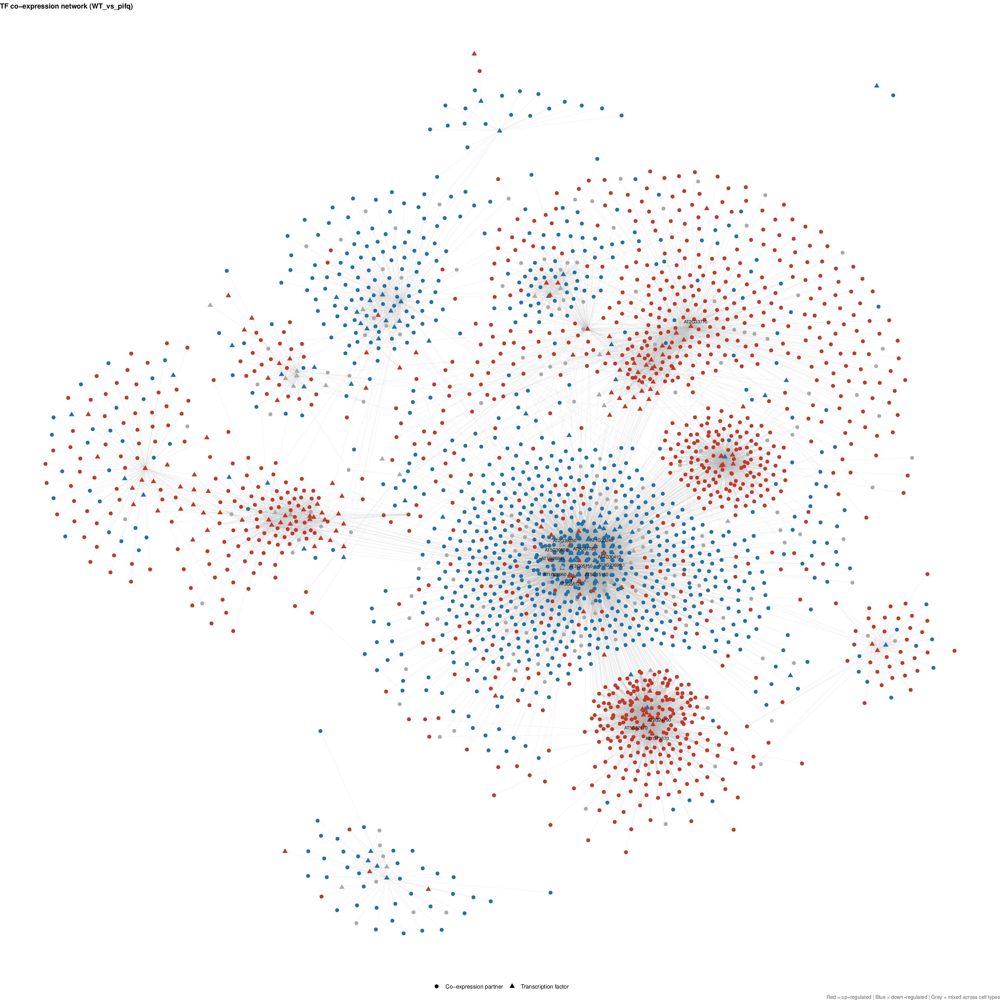{width=30%}

\newpage

# Part 4 - Pseudotime trajectory analysis (Python)

Chapter 3 runs in Python (scanpy, Palantir, scFates), starting from the h5ad
object exported at the end of Chapter 1
(`resultados/objects/pbmc_harmony_curated.h5ad`). Exit R and start Python
inside the same Docker container:

```bash
q()          # leave R (do not save the workspace)
python3
```

## Section 23 - Setup

```{python section_23_setup, eval=FALSE}
import os

PIPELINE_DIR = "/workspace/workflow"
DATA_DIR     = "/workspace/."
base_dir     = os.path.join(DATA_DIR, "resultados")

exec(open(os.path.join(PIPELINE_DIR, "load_libraries_python.py")).read(), globals())
exec(open(os.path.join(PIPELINE_DIR, "ScRNA_Pseudotime_Functions.py")).read(), globals())

dir_pseudotime = os.path.join(base_dir, "09_pseudotime")
os.makedirs(dir_pseudotime, exist_ok=True)

print("SECTION 23 COMPLETE: setup done")
```

## Section 24 - Load curated object

Reads the AnnData object, converts the Seurat-style UMAP/PCA/HARMONY coordinate
names to scanpy names, saves an overview UMAP, and prints the available cell
types (used to choose the trajectory in Section 25).

```{python section_24_load_object, eval=FALSE}
INPUT_H5AD     = "/workspace/resultados/objects/pbmc_harmony_curated.h5ad"
ANNOTATION_COL = "celltype_curated"
N_JOBS         = 4

adata, N_JOBS = load_curated_object(
    input_h5ad     = INPUT_H5AD,
    dir_pseudotime = dir_pseudotime,
    annotation_col = ANNOTATION_COL,
    n_jobs         = N_JOBS,
)
```

Representative output from Section 24:

{width=30%}

## Section 25 - Cell type selection

Picks the cell types used to build the trajectory. Here we follow the stomatal
lineage: cotyledon epidermis differentiating into guard cells. Names must match
the Section 24 list exactly.

```{python section_25_cell_selection, eval=FALSE}
TRAJECTORY_CLUSTERS = ["Epidermis Cotyledon", "guard cell"]

adata_sub = preview_trajectory_selection(
    adata          = adata,
    clusters       = TRAJECTORY_CLUSTERS,
    annotation_col = ANNOTATION_COL,
    dir_pseudotime = dir_pseudotime,
)
```

Representative output from Section 25:

{width=30%}

## Section 26 - Trajectory inference

Builds the trajectory with scFates: Palantir diffusion maps, a principal tree,
root selection at the progenitor cluster, and pseudotime assignment. Add more
`trajectory_run(...)` entries to sweep parameters.

```{python section_26_trajectory, eval=FALSE}
ROOT_CLUSTER = "Epidermis Cotyledon"

TRAJECTORY_RUNS = [
    trajectory_run(nodes=50, sigma=0.1, lambda_value=200, eigs=8, seed=3),
]

adata_traj, selected_trajectory_dir, trajectory_runs = run_trajectory_runs(
    adata           = adata,
    clusters        = TRAJECTORY_CLUSTERS,
    root_cluster    = ROOT_CLUSTER,
    annotation_col  = ANNOTATION_COL,
    output_base_dir = dir_pseudotime,
    runs            = TRAJECTORY_RUNS,
)
```

Representative outputs from Section 26:

```{=latex}
\begin{center}
```
{width=30%} {width=30%}
```{=latex}
\end{center}
```

## Section 27 - Plot genes on trajectory

Plots selected genes on the trajectory layout.

```{python section_27_gene_plots, eval=FALSE}
GENES = ["AT3G24140", "AT4G21750", "AT4G20260"]
name  = os.path.basename(selected_trajectory_dir)

ensure_expression_in_X(adata_traj)

gene_plots_dir = os.path.join(selected_trajectory_dir, "gene_plots")
os.makedirs(gene_plots_dir, exist_ok=True)

fig = sc.pl.draw_graph(
    adata_traj, color=GENES, title=GENES, show=False, return_fig=True
)
save_plot_18x18(fig, os.path.join(gene_plots_dir, f"{name}_gene_plots.pdf"))
plt.close(fig)

print("SECTION 27 COMPLETE: gene trajectory plots saved")
```

Representative output from Section 27:

{width=30%}

## Section 28 - Gene trends

Fits gene expression along pseudotime and saves two heatmaps: the top variable
genes, and a custom highlighted set.

```{python section_28_gene_trends, eval=FALSE}
TOP_N           = 10
HIGHLIGHT_GENES = ["AT3G24140", "AT4G21750", "AT4G20260"]
ORDERING        = "max"
SPLINE_DF       = 3

top_path, highlight_path = run_step29_gene_trends(
    adata        = adata_traj,
    run_dir      = selected_trajectory_dir,
    name         = os.path.basename(selected_trajectory_dir),
    custom_genes = HIGHLIGHT_GENES,
    top_n        = TOP_N,
    ordering     = ORDERING,
    n_jobs       = N_JOBS,
    spline_df    = SPLINE_DF,
)

print("SECTION 28 COMPLETE: gene trend plots saved")
```

Representative output from Section 28:

{width=30%}

## Section 29 - Final export

Saves the fully processed pseudotime object (trajectory tree, pseudotime, and
force-directed layout) as the pipeline's final Chapter 3 output, alongside the
curated Chapter 1 object in `resultados/objects/`.

```{python section_29_final_export, eval=FALSE}
final_h5ad = os.path.join(base_dir, "objects", "pbmc_pseudotime_final.h5ad")
os.makedirs(os.path.dirname(final_h5ad), exist_ok=True)
adata_traj.write_h5ad(final_h5ad)

print(f"SECTION 29 COMPLETE: final pseudotime object saved -> {final_h5ad}")
```
