```{r setup, include=FALSE}
knitr::opts_chunk$set(
  echo = TRUE,
  eval = FALSE,
  message = TRUE,
  warning = TRUE,
  error = FALSE
)
```

This methods-paper R Markdown documents the current Chapter 1 workflow only. It
is intentionally safe to knit: code blocks are displayed but not executed. To
run the analysis, execute the corresponding sections from
`workflow/capitulo1_single_cell.Rmd` inside the Docker container.

The active annotation path is bibliography-based
(`biblio_marks_custom.txt` -> `pbmc_harmony$celltype`). Reference-transfer
annotation is not part of this draft. The document stops after the optional
subcluster marker-inspection section; h5ad export, pseudobulk, DESeq2, GO,
network, and pseudotime analyses are intentionally excluded for now.

## Minimum computing requirements

The table below summarizes the computing requirements for running Chapter 1 on
a personal computer. These are practical requirements for the downstream
Seurat/R workflow after Cell Ranger output has already been produced.

| Component | Minimum | Recommended |
|---|---:|---:|
| Operating system | Linux, macOS, or WSL2 | Linux server or macOS with Docker Desktop |
| CPU cores | 4 | 16 or more |
| RAM | 32 GB | 64-128 GB for merged multi-sample objects |
| Disk space | 100 GB free | 500 GB or more when keeping FASTQ, Cell Ranger output, and R objects |
| Software | Docker | Docker plus external Cell Ranger installation |
| Inputs | Cell Ranger `filtered_feature_bc_matrix/` per sample | Raw FASTQ plus Cell Ranger output retained for provenance |

Small pilot datasets can be run on a laptop or desktop if memory is sufficient.
For full experiments, repeated clustering sweeps, Cell Ranger processing from
FASTQ, or large merged Seurat objects, a server or external cluster is strongly
recommended. Cell Ranger is CPU- and memory-intensive and is not installed
inside the downstream `matigara/scrnaseq:latest` Docker image.

## Materials and data preparation

The workflow is designed to run inside the Docker image
`matigara/scrnaseq:latest`, with the project directory mounted as
`/workspace`. In the current server setup, the relevant host paths are:

```text
/projects/aivvy/SingleCell/workflow/capitulo1_single_cell.Rmd
/projects/aivvy/SingleCell/workflow/ScRNA_Analysis_Functions.R
/projects/aivvy/resultados/
```

### Minimal components required to run the pipeline

The minimum inputs for Chapter 1 are:

1. A working Docker installation.
2. The SingleCell workflow files and helper functions.
3. One Cell Ranger `filtered_feature_bc_matrix/` directory per sample.
4. A bibliography marker table with columns `cell types` and `gene`.
5. Enough local or server memory to hold the merged Seurat object.

For this run, the marker table used by the workflow is:

```text
/workspace/biblio_marks_custom.txt
```

The marker-table order is biologically meaningful. The dotplot helper preserves
marker-table row order on the Y axis, while the X axis is ordered according to
the cell-type order implied by that same marker table. Labels with numeric
suffixes, such as `Epidermis Hypocotyl.1` and `Epidermis Hypocotyl.2`, are kept
adjacent to their parent marker category instead of being moved to the end.

### Docker startup

For a new local run, start the container from the host folder that contains the
data, workflow, and output directory:

```bash
docker run -it --rm \
  -v ~/your-workdir:/workspace \
  matigara/scrnaseq:latest /bin/bash
```

On the current server, the Docker container is already running and the project
is mounted at `/workspace`. From inside the container, start R and run the
workflow by sections:

```bash
R
```

### Raw data download and Cell Ranger processing

This Chapter 1 workflow starts from Cell Ranger output, specifically the
`outs/filtered_feature_bc_matrix/` folder for each sample. If only raw FASTQ
files are available, first download or stage the FASTQs, then run Cell Ranger
for each sample before starting the R workflow.

In the archived Chapter 0 run available on the server, raw FASTQ files were not
present at execution time. The script therefore validated existing Cell Ranger
outputs and copied the Cell Ranger metrics summaries. The validated run used
this layout:

```text
/workspace/cellranger/Sample_0N/outs/filtered_feature_bc_matrix/
/workspace/cellranger/Sample_05N/outs/filtered_feature_bc_matrix/
/workspace/cellranger/Sample_5N/outs/filtered_feature_bc_matrix/
```

The validation script used for that run is kept in the repository as:

```text
workflow/runs/cap0_r1.sh
```

Its logic checks, for each sample, that the following Cell Ranger files exist
and are non-empty:

```text
outs/filtered_feature_bc_matrix/matrix.mtx.gz
outs/filtered_feature_bc_matrix/barcodes.tsv.gz
outs/filtered_feature_bc_matrix/features.tsv.gz
outs/metrics_summary.csv
```

For a new analysis starting from public FASTQ files, first create a FASTQ
staging directory and download the reads. The exact accession list depends on
the experiment, but the workflow expects one folder per sample after download.
Common download patterns are:

```bash
# Option A: ENA/URL download when direct FASTQ links are available
mkdir -p /workspace/fastq/ScWT
wget -c -P /workspace/fastq/ScWT URL_TO_R1_FASTQ.gz
wget -c -P /workspace/fastq/ScWT URL_TO_R2_FASTQ.gz

# Option B: SRA Toolkit when SRR accessions are provided
prefetch SRR_ACCESSION
fasterq-dump SRR_ACCESSION --split-files --threads 8 --outdir /workspace/fastq/ScWT
gzip /workspace/fastq/ScWT/*.fastq
```

After FASTQs are available, run Cell Ranger for each sample. Cell Ranger is not
bundled inside the Docker image used for the downstream R/Python workflow, so it
should be run on the host, a server, or an HPC environment where Cell Ranger and
the appropriate reference transcriptome are installed.

Generic Cell Ranger command structure:

```bash
cellranger count \
  --id ScWT \
  --transcriptome /path/to/reference_transcriptome \
  --fastqs /path/to/fastq_directory \
  --sample ScWT \
  --localcores 16 \
  --localmem 128
```

Use the resulting `filtered_feature_bc_matrix/` path in the sample manifest in
Section 1.

### Cluster or server requirement

A cluster is not strictly required for small pilot datasets, but server or HPC
execution is recommended once the number of cells, samples, or parameter sweeps
increases. The most memory-intensive steps are merging samples, scaling,
PCA/UMAP, neighbor construction, marker detection, and subclustering. Cell
Ranger also benefits from multiple CPU cores and high memory, especially when
processing raw FASTQ files.


## Configuration


Edit this block before running the pipeline.


```{r configuration}
# CONFIGURATION - Edit only this block before running the pipeline
# =============================================================================

# Directory containing the pipeline helper scripts.
# Inside the Docker container this is typically /workspace/SingleCell
PIPELINE_DIR <- "/workspace/SingleCell/workflow"

# Root directory for your project data and results.
# All result files will be written to DATA_DIR/resultados/<step>/
DATA_DIR   <- "/workspace/."
base_dir   <- file.path(DATA_DIR, "resultados")

# =============================================================================
```


## Initialization


Load helper scripts, set reproducibility options, and create output directories.


```{r initialization}
# INITIALIZATION
# =============================================================================

# -- Load helper scripts --------------------------------------------------------
# Each file is fully documented at https://github.com/cliford2001/SingleCell
source(file.path(PIPELINE_DIR, "load_libraries.R"))          # all R packages
source(file.path(PIPELINE_DIR, "ScRNA_Analysis_Functions.R"))# analysis functions

set.seed(1807)
options(Seurat.allow.s4 = FALSE)  # required for Seurat 5 compatibility
setwd(DATA_DIR)

# -- Create per-step output directories ----------------------------------------
list2env(create_pipeline_dirs(base_dir), envir = .GlobalEnv)  # creates output folders and loads their paths as variables

# output_dir is the global variable used by save_pdf / save_qc / save_vln helpers.
# It is reassigned at the start of each section to the appropriate step directory.
output_dir <- base_dir


# =============================================================================
# ########################  PART 1 - SINGLE-CELL ANALYSIS  ####################
# =============================================================================
```


\newpage

## Section 1 - DATA LOADING AND PRE-FILTER QC


```{r section_01_data_loading_and_pre_filter_qc}
# SECTION 1 - DATA LOADING AND PRE-FILTER QC
# =============================================================================
# Each sample is loaded from its input file and mitochondrial / chloroplast
# read fractions are computed per cell to guide filtering thresholds in
# Section 2. Pre-filter violin plots are saved to 01_qc/.
#
# +- CHANGE FOR YOUR ORGANISM --------------------------------------------------
#   Arabidopsis : mt_pattern = "^ATMG"  |  cp_pattern = "^ATCG"
#   Human       : mt_pattern = "^MT-"   |  cp_pattern = NULL
#   Mouse       : mt_pattern = "^mt-"   |  cp_pattern = NULL
# +-----------------------------------------------------------------------------
output_dir <- dir_01

# -- Sample manifest (CellRanger filtered_feature_bc_matrix) ------------------
# Add one entry per sample. Each entry needs:
#   file      - path to the filtered_feature_bc_matrix/ directory (relative to DATA_DIR)
#   label     - unique name for this sample (appears in all plots)
#   condition - experimental group this sample belongs to
samples <- list(
  list(file = "cellranger_v2/ScWT/outs/filtered_feature_bc_matrix",  label = "WT",  condition = "WT"),
  list(file = "cellranger_v2/Scpifq/outs/filtered_feature_bc_matrix", label = "pifq", condition = "pifq"))


# -- Plot colors (one color per sample label) -----------------------------------
colors <- c(
  "WT"  = "#66c2a5",
  "pifq"  = "#fc8d62"
)


mt_pattern <- "^ATMG"  # Arabidopsis mitochondrial genes
cp_pattern <- "^ATCG"  # Arabidopsis chloroplast genes


# Load all samples using the helper function
seurat_list_raw <- load_seurat_samples(samples = samples,
                                       DATA_DIR = DATA_DIR,
                                       mt_pattern = mt_pattern,
                                       cp_pattern = cp_pattern)

plot_qc_batch(seurat_list_raw, colors, "qc_prefilter.pdf")


# =============================================================================

message("\nOK SECTION 1 COMPLETE: QC pre-filter plots saved")
```

Representative output from Section 1:

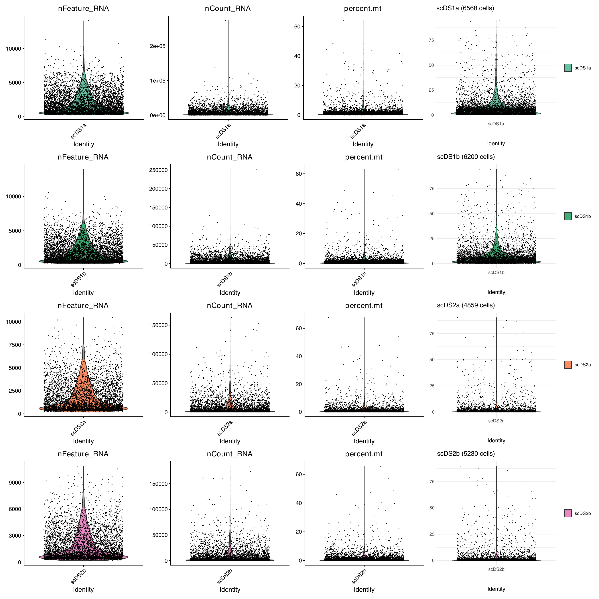{width=55%}


\newpage

## Section 2 - CELL FILTERING AND DOUBLET DETECTION


```{r section_02_cell_filtering_and_doublet_detection}
# SECTION 2 - CELL FILTERING AND DOUBLET DETECTION
# =============================================================================
# Thresholds are set based on the pre-filter violin plots (01_qc/qc_prefilter.pdf).
# Cells below min_features or above max_mt are removed. DoubletFinder is
# applied per sample to discard putative doublets.
#
# +- ADJUST THRESHOLDS AFTER INSPECTING 01_qc/qc_prefilter.pdf -----------------
#   min_features : minimum number of detected genes per cell (default 200)
#   max_mt       : maximum mitochondrial read percentage  (default 5 %)
# +-----------------------------------------------------------------------------
output_dir <- dir_01   # both pre- and post-filter QC plots go to 01_qc/

seurat_list <- filter_seurat_samples(seurat_list_raw, min_features = 200, max_mt = 5)

plot_qc_batch(seurat_list, colors, "qc_postfilter.pdf")

# Checkpoint - restore with: seurat_list <- readRDS("resultados/objects/seurat_list_postfilter.rds")
saveRDS(seurat_list, file.path(dir_objects, "seurat_list_postfilter.rds"))


# =============================================================================

message("\nOK SECTION 2 COMPLETE: Filtering and doublet detection complete")
```

Representative output from Section 2:

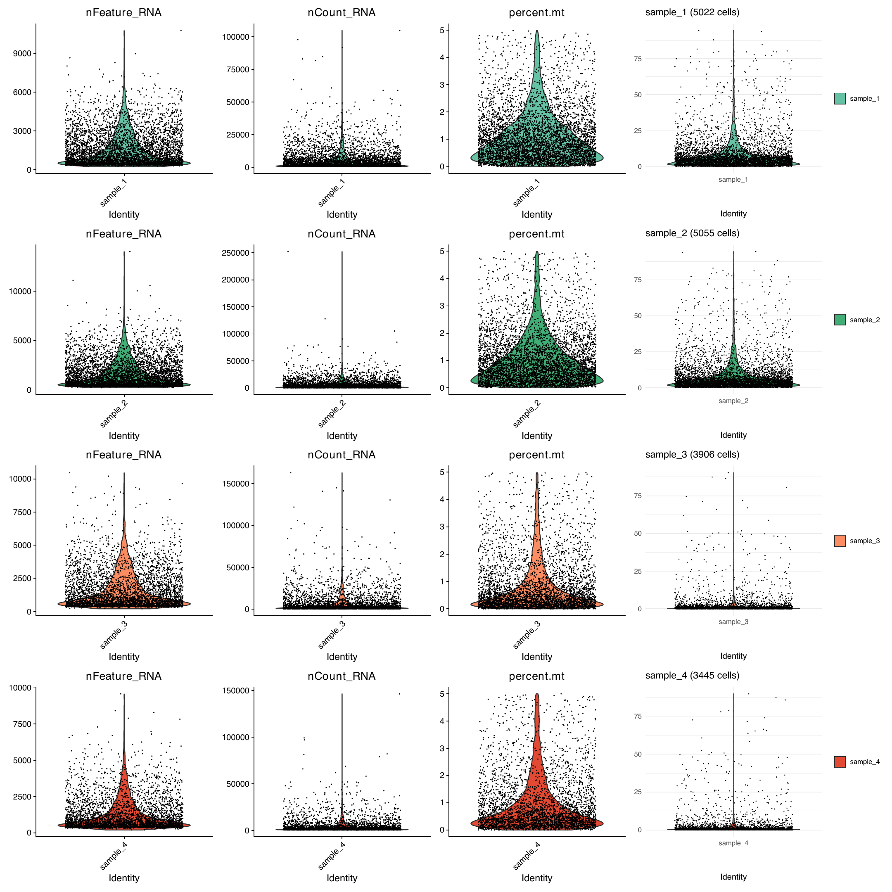{width=55%}


\newpage

## Section 3 - MERGE AND INITIAL PREPROCESSING


```{r section_03_merge_and_initial_preprocessing}
# SECTION 3 - MERGE AND INITIAL PREPROCESSING
# =============================================================================
# Filtered samples are merged and preprocessed: log-normalization, variable
# feature selection (VST, 2,000 features), scaling, PCA (30 PCs), and UMAP.
# The resulting UMAP shows batch effects before integration.

output_dir <- dir_01

pbmc_harmony <- reduce(seurat_list, merge) %>%  # merge all samples into one object
  NormalizeData(verbose = FALSE) %>%
  FindVariableFeatures(selection.method = "vst", nfeatures = 2000, verbose = FALSE) %>%
  ScaleData(verbose = FALSE) %>%
  RunPCA(npcs = 30, verbose = FALSE) %>%
  RunUMAP(reduction = "pca", dims = 1:30, verbose = FALSE)

save_pdf(DimPlot(pbmc_harmony, group.by = "orig.ident", cols = colors),
         "umap_preharmony.pdf")

# Checkpoint - restore with: pbmc_harmony <- readRDS("resultados/objects/pbmc_harmony_preharmony.rds")
saveRDS(pbmc_harmony, file.path(dir_objects, "pbmc_harmony_preharmony.rds"))


# =============================================================================

message("\nOK SECTION 3 COMPLETE: Merge and preprocessing complete")
```

Representative output from Section 3:

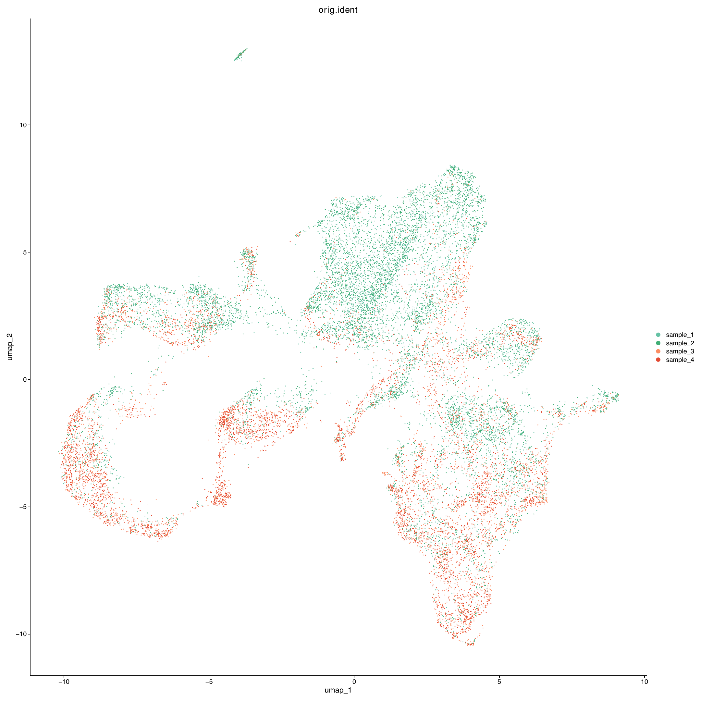{width=55%}


\newpage

## Section 4 - HARMONY BATCH CORRECTION


```{r section_04_harmony_batch_correction}
# SECTION 4 - HARMONY BATCH CORRECTION
# =============================================================================
# Harmony adjusts cell embeddings to remove sample-level batch effects while
# preserving biological variation. All downstream steps use the "harmony"
# reduction instead of "pca".

output_dir <- dir_01

pbmc_harmony <- pbmc_harmony %>%
  RunHarmony("orig.ident", plot_convergence = FALSE) %>%
  RunUMAP(reduction = "harmony", dims = 1:30, verbose = FALSE)

save_pdf(DimPlot(pbmc_harmony, group.by = "orig.ident", cols = colors),
         "umap_postharmony.pdf")

# Checkpoint - restore with: pbmc_harmony <- readRDS("resultados/objects/pbmc_harmony_postharmony.rds")
saveRDS(pbmc_harmony, file.path(dir_objects, "pbmc_harmony_postharmony.rds"))


# =============================================================================

message("\nOK SECTION 4 COMPLETE: Harmony integration complete")
```

Representative output from Section 4:

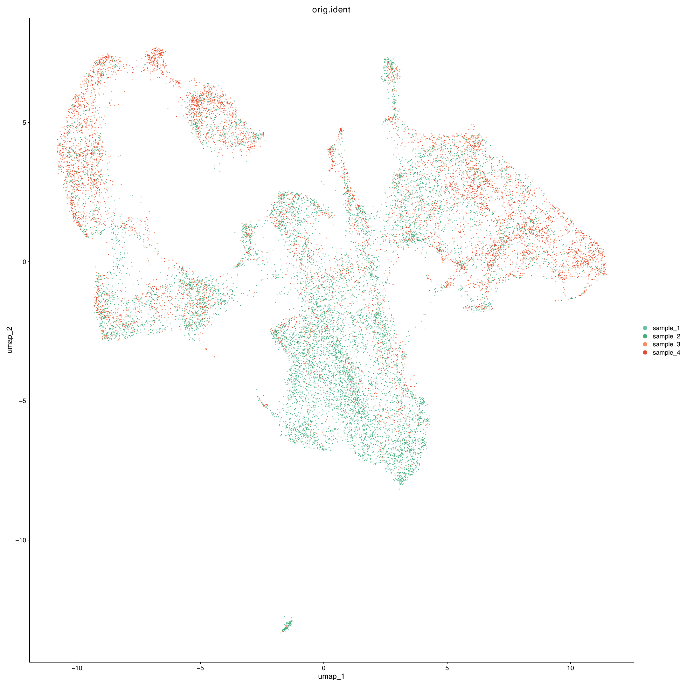{width=55%}


\newpage

## Section 5 - RESOLUTION OPTIMIZATION


```{r section_05_resolution_optimization}
# SECTION 5 - RESOLUTION OPTIMIZATION
# =============================================================================
# Clustree tracks how Leiden communities split or merge across candidate
# resolutions. Choose the lowest resolution where clusters stabilize.
#
# +- PARAMETERS ----------------------------------------------------------------
#   resolutions_test : Leiden resolutions swept by clustree
#   -> Inspect elbow_plot.pdf and clustree2.pdf before setting cluster_resolution in Section 6.
# +-----------------------------------------------------------------------------
resolutions_test <- c(0.15, 0.35, 0.45, 0.55, 1.0)

output_dir <- dir_02

# Elbow plot: k-means within-cluster sum of squares across candidate k values.
# This is only a diagnostic plot; it does not change the clustering parameters.
k_range <- 1:31
pca_data <- Embeddings(pbmc_harmony, "pca")[, 1:30]
wss <- sapply(
  k_range,
  function(k) kmeans(pca_data, centers = k, nstart = 4)$tot.withinss
)

elbow_plot <- ggplot(data.frame(k = k_range, wss = wss), aes(k, wss)) +
  geom_line() +
  geom_point() +
  labs(
    x = "Number of clusters (k)",
    y = "Within-cluster sum of squares"
  ) +
  theme_minimal()

save_pdf(elbow_plot, "elbow_plot.pdf", w = 18, h = 18)

clu <- pbmc_harmony %>%
  RunUMAP(reduction = "harmony", dims = 1:30, verbose = FALSE) %>%
  FindNeighbors(reduction = "harmony", dims = 1:30,
                k.param = 20, verbose = FALSE)

for (res in resolutions_test)
  clu <- FindClusters(clu, resolution = res, algorithm = 4, verbose = FALSE)

save_pdf(clustree(clu, prefix = "RNA_snn_res."), "clustree2.pdf", w = 18, h = 18)


# =============================================================================

message("\nOK SECTION 5 COMPLETE: Elbow plot and clustree saved - inspect elbow_plot.pdf and clustree2.pdf before setting resolution")
```

Representative outputs from Section 5:

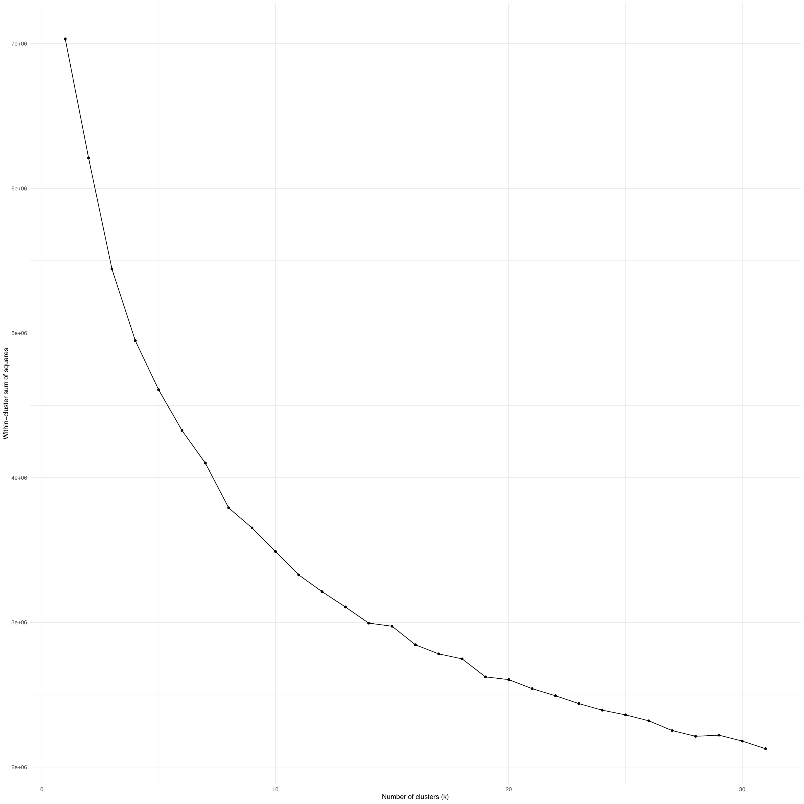{width=55%}

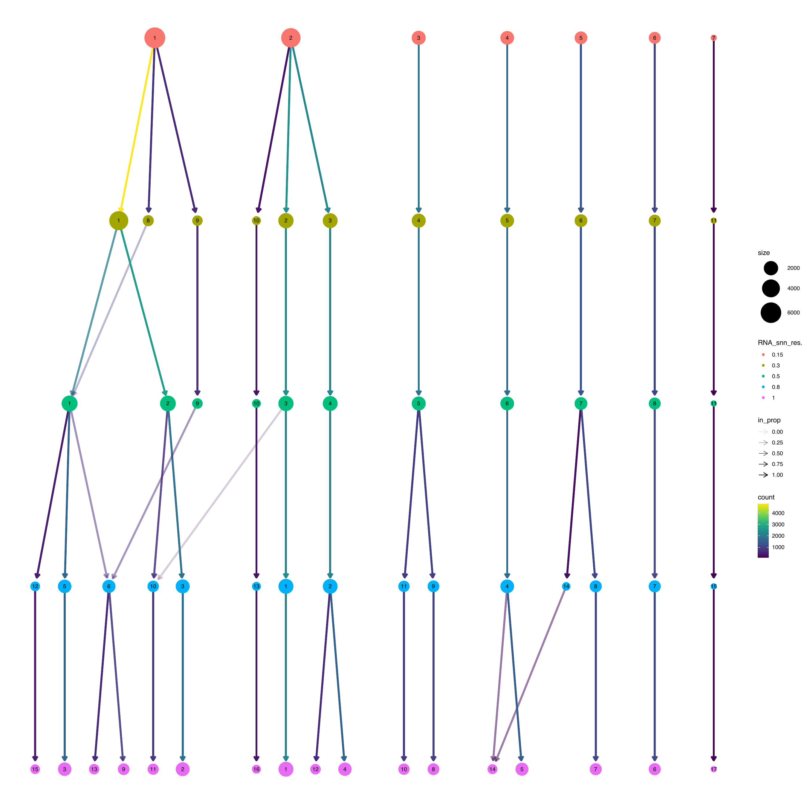{width=55%}


\newpage

## Section 6 - FINAL CLUSTERING


```{r section_06_final_clustering}
# SECTION 6 - FINAL CLUSTERING
# =============================================================================
# Apply the selected resolution for the final cluster assignment.
# After clustering, a UMAP coloured by Seurat cluster and a bar chart of
# cells per sample are saved to 02_clustering/.
#
# +- SET RESOLUTION AFTER INSPECTING clustree.pdf -----------------------------
#   cluster_resolution : Leiden resolution for final clustering (default 0.3)
# +-----------------------------------------------------------------------------
cluster_resolution <- 0.35
output_dir <- dir_02

# clu (Section 5) was temporary - re-run on pbmc_harmony to embed the final clusters
pbmc_harmony <- pbmc_harmony %>%
  RunUMAP(reduction = "harmony", dims = 1:30, verbose = FALSE) %>%
  FindNeighbors(reduction = "harmony", dims = 1:30,
                k.param = 20, verbose = FALSE) %>%
  FindClusters(resolution = cluster_resolution, algorithm = 4, verbose = FALSE)

Idents(pbmc_harmony) <- "seurat_clusters"
save_pdf(DimPlot(pbmc_harmony, group.by = "seurat_clusters", label = TRUE),
         "umap_seuratclusters.pdf")


# =============================================================================

message("\nOK SECTION 6 COMPLETE: Final clustering complete")
```

Representative output from Section 6:

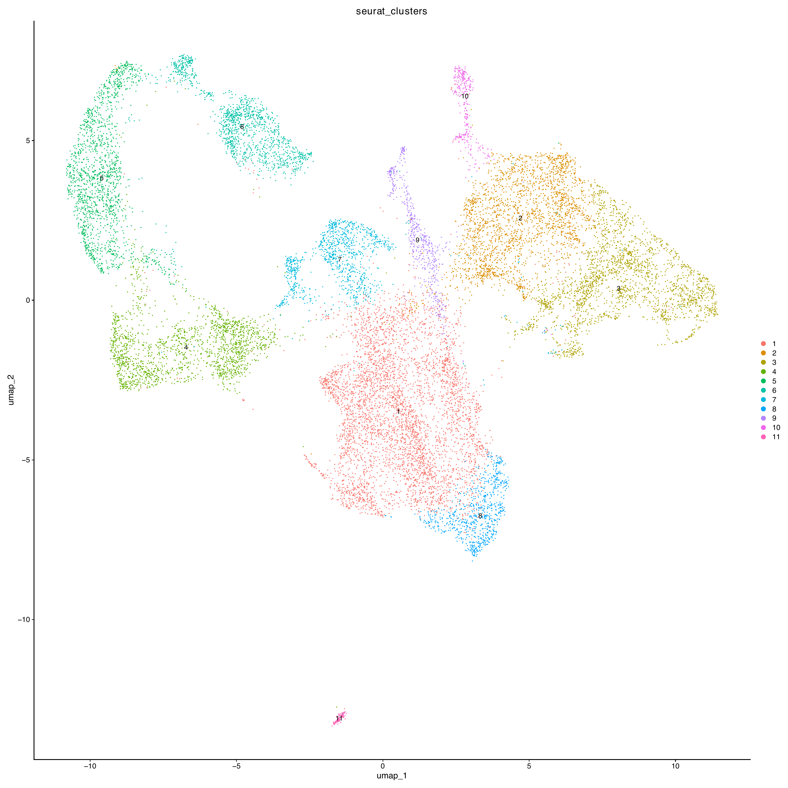{width=55%}


\newpage

## Section 7 - CELL-TYPE ANNOTATION


```{r section_07_cell_type_annotation}
# SECTION 7 - CELL-TYPE ANNOTATION
# =============================================================================
# Cell-type labels are assigned via bibliography-based markers
# (biblio_marks.txt): the marker table read above is crossed with
# cluster-level differential genes to assign initial labels automatically.
# Result stored in pbmc_harmony$celltype.
#
# A second strategy - reference transfer from a published Seurat object
# (e.g. an Arabidopsis leaf atlas) via FindTransferAnchors/TransferData - is
# not run by default. The full block, plus the downstream sections wired to
# it, is preserved in capitulo1_single_cell_reference_backup.R.

output_dir <- dir_03

biblio_marks_file <- file.path(DATA_DIR, "biblio_marks_custom.txt")
marker_table      <- read.table(biblio_marks_file, header = TRUE, sep = "\t", quote = "")

# -- Bibliography-based annotation ---------------------------------------------
markers <- find_markers(pbmc_harmony,
                        output_file = file.path(output_dir, "FindAllMarkers.tsv"))

pbmc_harmony <- annotate_by_markers(pbmc_harmony, markers,
                                    reference_file = biblio_marks_file)
# Annotation stored in: pbmc_harmony$celltype

plot_marker_dotplot(
  pbmc_harmony,
  marker_table,
  annot_col = "celltype", # uses the newly assigned annotation column
  outfile   = file.path(output_dir, "dotplot_marker_table_annotation_biblio.pdf"),
  width = 18, height = 18
)

save_pdf(DimPlot(pbmc_harmony, group.by = "celltype",
                 label = TRUE, repel = TRUE, raster = FALSE),
         "umap_annotation_biblio.pdf")


# =============================================================================

message("\nOK SECTION 7 COMPLETE: Cell-type annotation complete")
```

Representative outputs from Section 7:

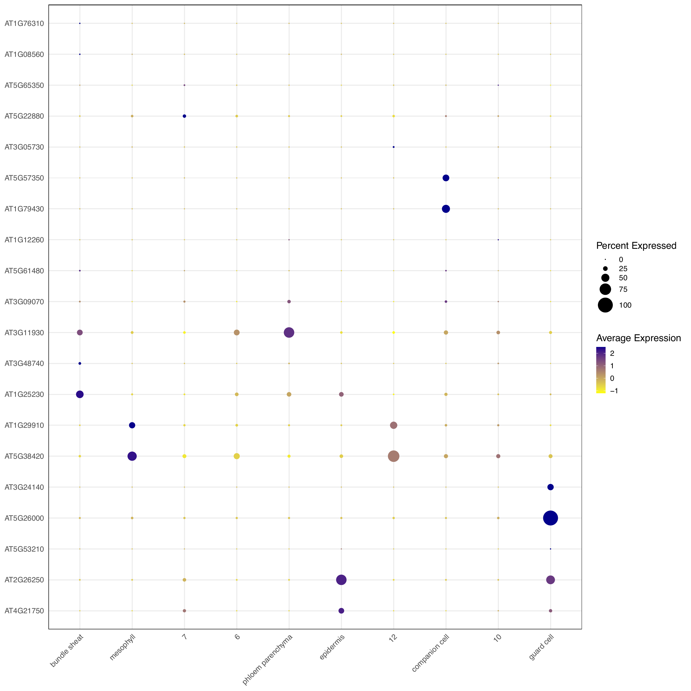{width=55%}

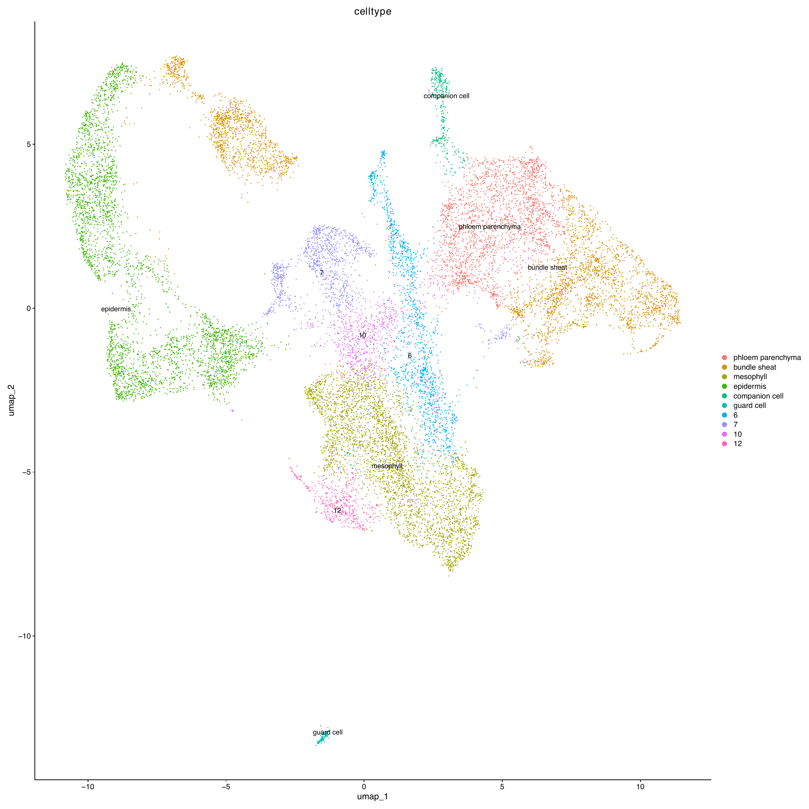{width=55%}


\newpage

## Section 8 - ANNOTATED CLUSTREE


```{r section_08_annotated_clustree}
# SECTION 8 - ANNOTATED CLUSTREE
# =============================================================================
# Reuses the resolution sweep object from Section 5 and overlays the final
# bibliography-based annotation on each node.

output_dir <- dir_03

# Mode: returns the most frequent annotation in each clustree node.
Mode <- function(x) {
  x <- as.character(x)
  x <- x[!is.na(x) & nzchar(x)]
  if (length(x) == 0) return(NA_character_)
  names(sort(table(x), decreasing = TRUE))[1]
}

stopifnot(exists("clu"))
stopifnot("celltype" %in% colnames(pbmc_harmony@meta.data))

celltype_label <- as.character(pbmc_harmony$celltype)
names(celltype_label) <- Cells(pbmc_harmony)
clu$celltype_label <- celltype_label[Cells(clu)]

print(table(clu$celltype_label, useNA = "ifany"))

save_pdf(
  clustree(clu, prefix = "RNA_snn_res.",
           node_label = "celltype_label", node_label_aggr = "Mode"),
  "clustree_annotated.pdf", w = 14, h = 14
)


# =============================================================================

message("\nOK SECTION 8 COMPLETE: Annotated clustree saved")
```

Representative output from Section 8:

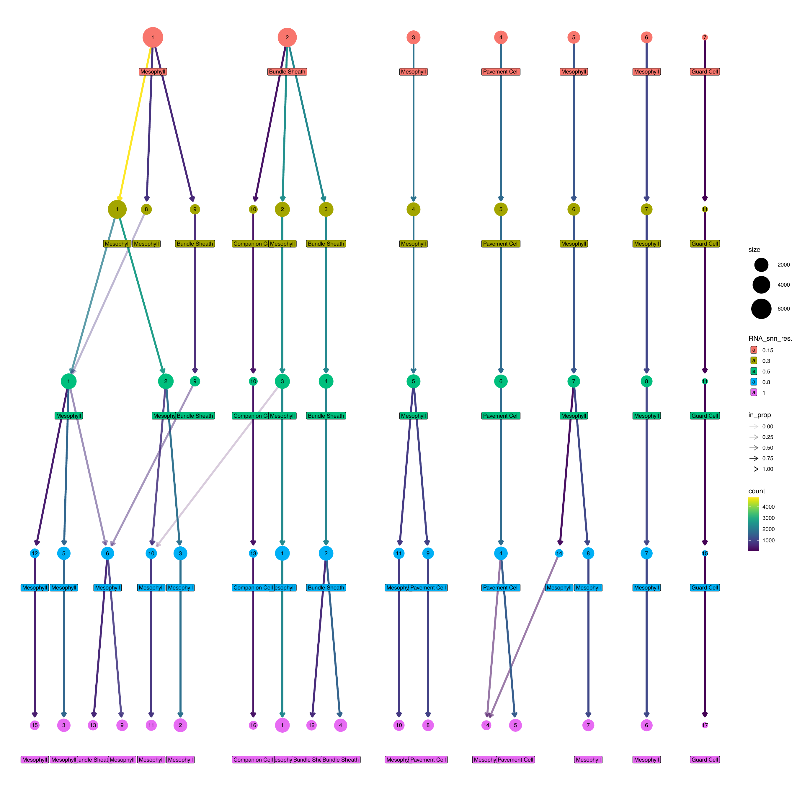{width=55%}


\newpage

## Section 9 - GENE EXPRESSION VISUALIZATION


```{r section_09_gene_expression_visualization}
# SECTION 9 - GENE EXPRESSION VISUALIZATION
# =============================================================================
# Simple inspection for one gene: violin plot across all annotated cell types
# and UMAP expression overlay.
#
# +- SET GENE TO INSPECT ------------------------------------------------------
#   gene : single gene to inspect
# +-----------------------------------------------------------------------------
gene <- "AT5G26000"

output_dir <- dir_04

# JoinLayers is required in Seurat 5 after merging samples.
pbmc_harmony <- JoinLayers(pbmc_harmony)
Idents(pbmc_harmony) <- "celltype"

save_vln(
  VlnPlot(pbmc_harmony, features = gene),
  "vln_gene_all.pdf"
)

save_pdf(
  FeaturePlot(pbmc_harmony, features = gene),
  "feature_gene_all.pdf"
)

# =============================================================================

message("\nOK SECTION 9 COMPLETE: Gene expression visualization saved")
```

Representative outputs from Section 9:

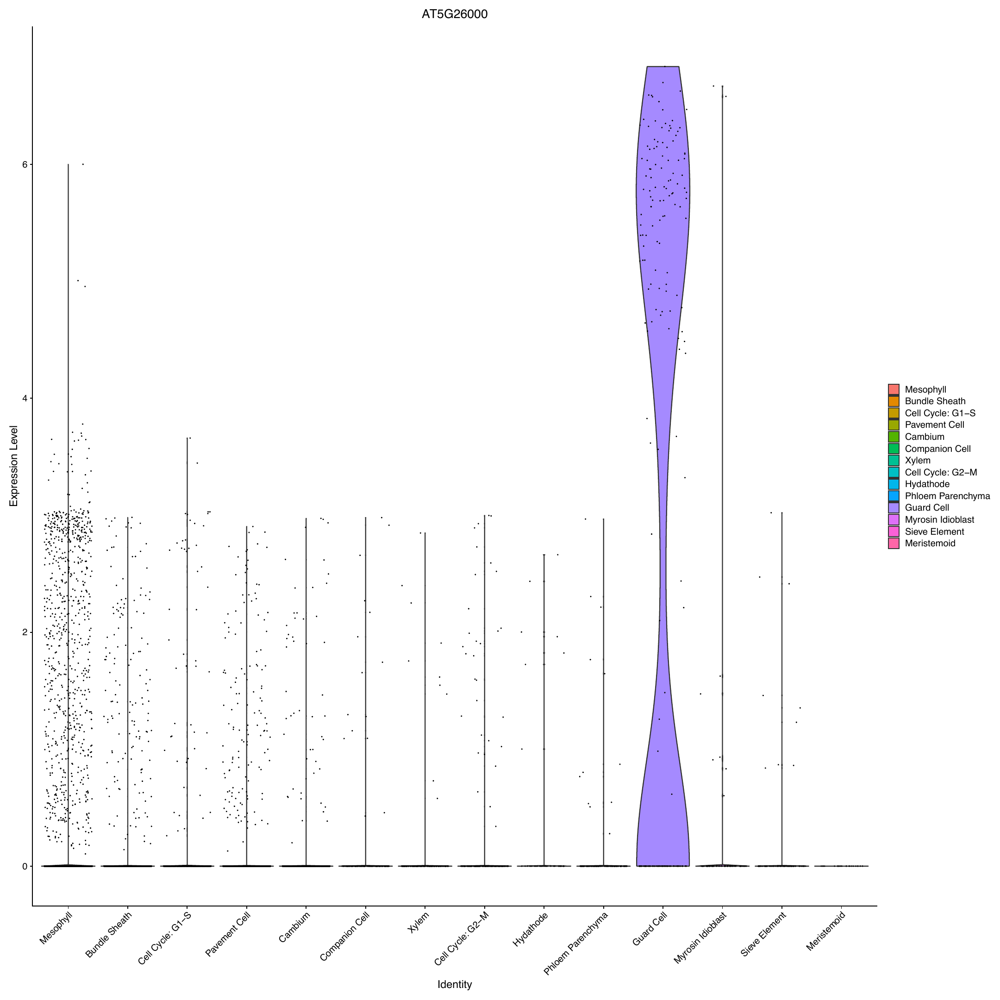{width=55%}

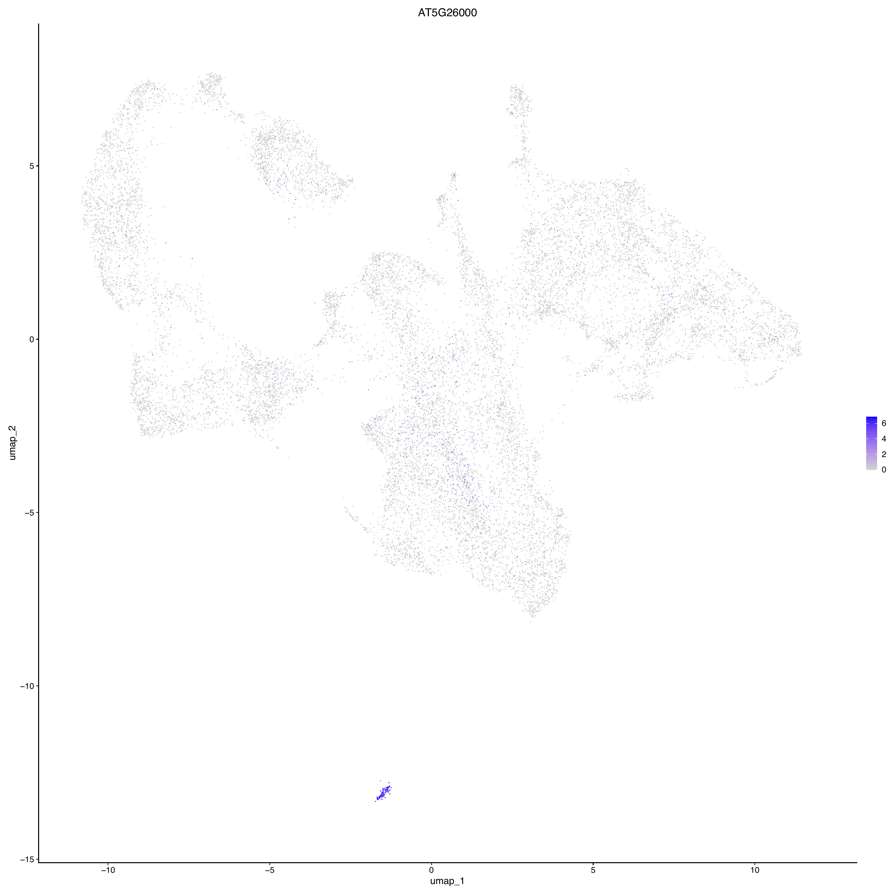{width=55%}


\newpage

## Section 10 - CELL-TYPE GROUPING  [OPTIONAL]


```{r section_10_cell_type_grouping_optional}
# SECTION 10 - CELL-TYPE GROUPING  [OPTIONAL]
# =============================================================================
# Fine-grained labels are collapsed into broader categories for downstream
# analyses. Cell types NOT listed in 'grouping' keep their original label.
# Skip this section if you do not need to merge cell types.
#
# +- EDIT THIS MAP TO MATCH YOUR CELL TYPES -----------------------------------
#   Left side  : original label (must match exactly)
#   Right side : new broader label to assign
# +-----------------------------------------------------------------------------
# Leave empty if you do not want to merge labels.
#
# Example: uncomment and edit this if Section 7 produced several labels that
# should be treated as one broader group downstream.
#
# grouping <- c(
#   "Epidermis Hypocotyl.1" = "Epidermis Hypocotyl",
#   "Epidermis Hypocotyl.2" = "Epidermis Hypocotyl",
#   "Epidermis Hypocotyl.3" = "Epidermis Hypocotyl",
#   "ENDO1" = "Endodermis",
#   "ENDO2" = "Endodermis",
#   "PHLOEM AND SIEVE ELEMENT" = "PHLOEM"
# )
#
# Current default: no grouping; celltype_grouped is a straight pass-through
# of celltype.
grouping <- c()

output_dir <- dir_05

# !!! unpacks the grouping vector as named arguments to recode()
# recode() errors on an empty replacement list, so an empty `grouping` (no
# merging needed) falls back to a straight pass-through instead.
if (length(grouping) > 0) {
  pbmc_harmony$celltype_grouped <- recode(pbmc_harmony$celltype, !!!grouping)
} else {
  pbmc_harmony$celltype_grouped <- pbmc_harmony$celltype
}

save_pdf(
  DimPlot(pbmc_harmony, group.by = "celltype_grouped",  # grouped broad cell types
          label = TRUE, repel = TRUE, raster = FALSE),
  "umap_grouped.pdf"
)


# =============================================================================

message("\nOK SECTION 10 COMPLETE: Cell-type grouping complete")
```

Representative output from Section 10:

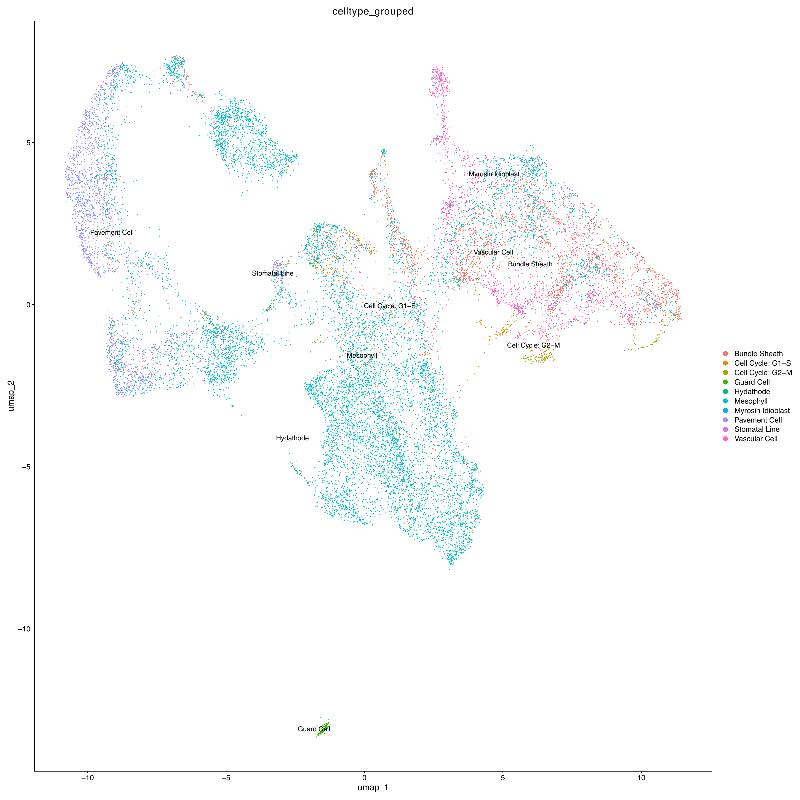{width=55%}


\newpage

## Section 11 - SUBCLUSTER MARKER INSPECTION  [OPTIONAL]


This section is intentionally interactive. It is used to test marker expression
against subclusters before deciding whether manual curation is needed. The
section does not modify `pbmc_harmony` by default. Individual subcluster UMAPs
are saved in a wide format so that UMAP dimensions keep the same visual
proportions and do not appear compressed in the report.


```{r section_11_interactive_cell_type_curation_optional, eval=FALSE}
# SECTION 11 - SUBCLUSTER MARKER INSPECTION  [OPTIONAL]
# =============================================================================
# !!! WARNING: Run this section interactively, step by step.
# !!! Do NOT source the entire script with this section active.
# Skip this section if you are satisfied with the annotation from Section 7.
#
# Purpose: pick one or more annotated cell types, subcluster them, and inspect
# marker expression across the subclusters before deciding whether any manual
# reassignment is needed. This section does NOT modify pbmc_harmony by default.

output_dir   <- dir_05
curation_col <- "celltype"
Idents(pbmc_harmony) <- curation_col

print(table(pbmc_harmony[[curation_col]], useNA = "ifany"))

# Edit this vector using exact names from the table above.
# Example options:
#   types_to_inspect <- c("Epidermis Hypocotyl.1")
#   types_to_inspect <- c("Epidermis Hypocotyl.1", "Epidermis Hypocotyl.2")
#   types_to_inspect <- names(table(pbmc_harmony[[curation_col]]))  # all labels; can be slow

types_to_inspect <- c("2","4","5","8")

subcluster_resolution <- 0.3
subcluster_dims       <- 1:20

subcluster_list    <- list()
inspection_entries <- list()

for (ct in types_to_inspect) {
  safe_name <- make.names(ct)
  file_tag  <- gsub("[^A-Za-z0-9]+", "_", ct)

  message("\nInspecting: ", ct)

  sub_obj <- subcluster_cell_type(
    pbmc_harmony,
    tipo       = ct,
    annot_col  = curation_col,
    resolution = subcluster_resolution,
    dims       = subcluster_dims
  )

  subcluster_list[[safe_name]] <- sub_obj
  print(table(sub_obj$cluster_subtipo, useNA = "ifany"))

  p_dim <- plot_subcluster_umap(sub_obj, ct, output_dir)

  plot_marker_dotplot(
    sub_obj,
    marker_table,
    annot_col = "cluster_subtipo",
    outfile   = file.path(output_dir, paste0("dotplot_markers_subclusters_", file_tag, ".pdf")),
    width = 18,
    height = 18
  )

  inspection_entries[[safe_name]] <- list(
    umap_plot = p_dim,
    obj       = sub_obj
  )
}

save_subcluster_composite(
  subcluster_list = inspection_entries,
  marker_table    = marker_table,
  output_dir      = output_dir,
  filename        = "subclustering_marker_inspection2.pdf"
)

# After reviewing the PDFs, manually decide whether to reassign subclusters.
# Nothing is changed in pbmc_harmony unless you run an apply_subcluster_reassignment()
# block intentionally.

# Example reassignment template, left commented on purpose:
#
# reassign <- list(
#   Epidermis.Hypocotyl.1 = c(
#     "0"      = "Epidermis Hypocotyl",
#     "1"      = "Epidermis Cotyledon",
#     "others" = "Epidermis Hypocotyl"
#   )
# )
#
# pbmc_harmony <- apply_subcluster_reassignment(
#   obj             = pbmc_harmony,
#   subcluster_list = subcluster_list,
#   reassign        = reassign,
#   source_col      = curation_col,
#   dest_col        = "celltype_curated"
# )
#
# save_pdf(
#   DimPlot(pbmc_harmony, group.by = "celltype_curated",
#           label = TRUE, repel = TRUE, raster = FALSE),
#   "umap_curated.pdf"
# )
# saveRDS(pbmc_harmony, file.path(dir_objects, "pbmc_harmony_curated.rds"))

# =============================================================================

message("\nOK SECTION 11 COMPLETE: Subcluster marker inspection saved")
```

Representative output from Section 11:

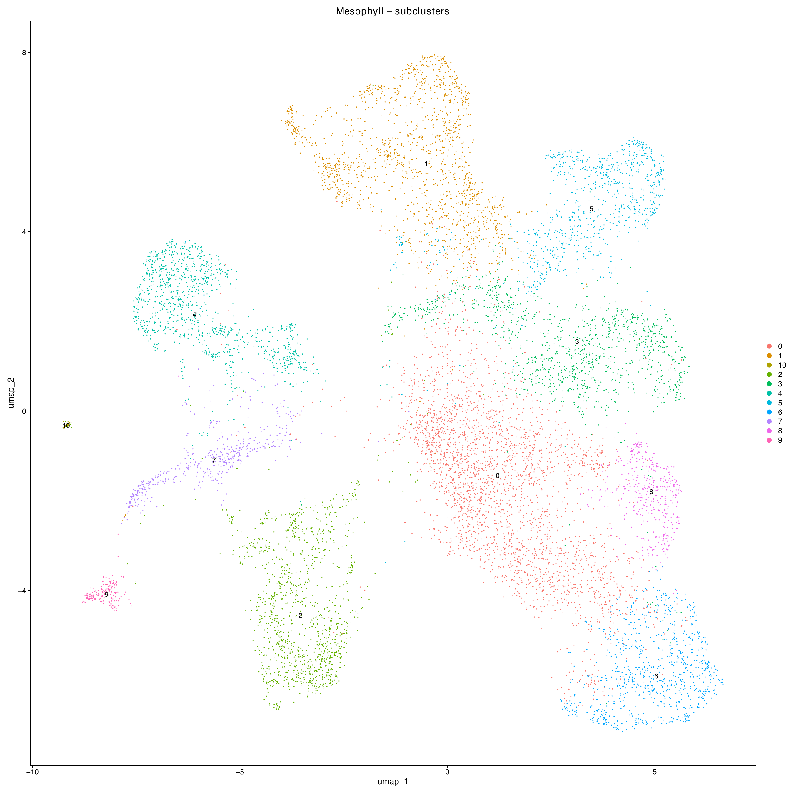{width=55%}

## Current stopping point

This methods draft stops at optional subcluster marker inspection. Export to
h5ad, pseudobulk, DESeq2, enrichment, network analysis, and pseudotime are not
included in this version.

\newpage

## Supplementary information

### Docker image program and package versions

The following version tables were generated from the active Docker container
used to render this methods draft. The complete machine-readable files are kept
next to this R Markdown file:

```text
reports/docker_cli_versions.tsv
reports/docker_r_package_versions.tsv
reports/docker_python_package_versions.tsv
```

```{r supplementary-cli-versions, eval=TRUE, echo=FALSE, results='asis'}
version_file <- function(path) {
  if (file.exists(path)) return(path)
  file.path("reports", path)
}

cli_versions <- read.delim(version_file("docker_cli_versions.tsv"), check.names = FALSE)
knitr::kable(cli_versions, caption = "Command-line tools detected in the Docker image.")
```

```{r supplementary-r-versions, eval=TRUE, echo=FALSE, results='asis'}
r_versions <- read.delim(version_file("docker_r_package_versions.tsv"), check.names = FALSE)
if ("Priority" %in% colnames(r_versions)) {
  r_versions <- r_versions[is.na(r_versions$Priority) | !(r_versions$Priority %in% c("base", "recommended")), ]
}
knitr::kable(r_versions, caption = "R package inventory in the Docker image, excluding base/recommended R packages.")
```

```{r supplementary-python-versions, eval=TRUE, echo=FALSE, results='asis'}
python_versions <- read.delim(version_file("docker_python_package_versions.tsv"), check.names = FALSE)
knitr::kable(python_versions, caption = "Complete Python package inventory in the Docker image.")
```
